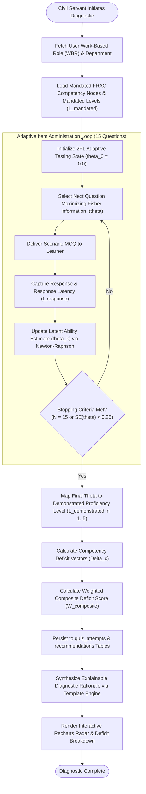
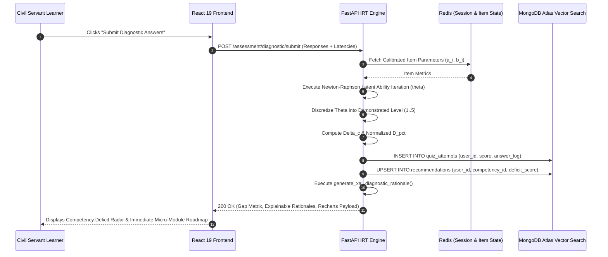

# 01_Competency_Gap_Engine.md

# Competency Gap Diagnostic Engine: AI Karmayogi

**Mathematical Specifications, FRAC Taxonomy Hierarchy, Adaptive Psychometric Testing, and Explainable Gap Diagnostics**

**Document Version:** 1.0.0  
**Target Program:** Smart India Hackathon 2026  
**Problem Statement ID:** SIH26101  
**Project Name:** AI Karmayogi  
**Classification:** Enterprise Government Specification — Phase 3 AI Engine  

---

## Table of Contents
1. [FRAC Competency Taxonomy & Structural Hierarchy](#1-frac-competency-taxonomy--structural-hierarchy)
2. [End-to-End Diagnostic Assessment Workflow](#2-end-to-end-diagnostic-assessment-workflow)
3. [Psychometric Item Response Theory (IRT) Adaptive Testing Model](#3-psychometric-item-response-theory-irt-adaptive-testing-model)
4. [Competency Deficit Scoring Algorithms & Mathematical Formulations](#4-competency-deficit-scoring-algorithms--mathematical-formulations)
5. [Domain, Functional & Behavioral Weighting Matrices](#5-domain-functional--behavioral-weighting-matrices)
6. [Departmental Competency Heatmap Aggregation Engine](#6-departmental-competency-heatmap-aggregation-engine)
7. [Explainable AI (XAI) Diagnostic Reasoning Generation](#7-explainable-ai-xai-diagnostic-reasoning-generation)
8. [Edge Case Resolution Protocols](#8-edge-case-resolution-protocols)
9. [Mermaid System Architecture & Flow Diagrams](#9-mermaid-system-architecture--flow-diagrams)

---

## 1. FRAC Competency Taxonomy & Structural Hierarchy

Under the **National Programme for Civil Services Capacity Building (NPCSCB - Mission Karmayogi)**, competencies are standardized by the **Capacity Building Commission (CBC)** under the **Framework of Roles, Activities, and Competencies (FRAC)**.

The taxonomy organizes civil service capabilities into a 3-tier hierarchical structure:

```
+----------------------------------------------------------------------------------------------------+
|                                    FRAC COMPETENCY TAXONOMY HIERARCHY                              |
+----------------------------------------------------------------------------------------------------+
|                                                                                                    |
|  [ LEVEL 1: WORK-BASED ROLE (WBR) ]                                                                |
|  * Defined by Cadre & Desk Allocation (e.g., Drawing & Disbursing Officer - DDO).                  |
|                                         |                                                          |
|                                         v                                                          |
|  [ LEVEL 2: THREE CORE COMPETENCY PILLARS ]                                                        |
|  +---------------------------+---------------------------+---------------------------------------+  |
|  |   BEHAVIORAL COMPETENCY   |   FUNCTIONAL COMPETENCY   |           DOMAIN COMPETENCY           |  |
|  |  Citizen Empathy, Ethics, |  GFR 2017, GeM, Drafting, |  Direct Taxation, Rural Sanitation,   |  |
|  |  Strategic Thinking       |  Vigilance, RTI Disposal  |  Renewable Energy Standards           |  |
|  +---------------------------+---------------------------+---------------------------------------+  |
|                                         |                                                          |
|                                         v                                                          |
|  [ LEVEL 3: STANDARDIZED PROFICIENCY TIERS (Levels 1 to 5) ]                                       |
|  * Level 1 (Basic Awareness): Recognizes terms, follows standardized checklists under supervision.  |
|  * Level 2 (Novice Practitioner): Executes routine procedures, identifies common statutory errors. |
|  * Level 3 (Working Proficiency): Autonomously resolves ambiguous cases; interprets GFR/OM clauses.|
|  * Level 4 (Advanced Authority): Formulates executive decisions; handles legal appeals & tenders. |
|  * Level 5 (Mastery / Expert): Drafts national policies, Acts, and ministerial amendments.         |
|                                                                                                    |
+----------------------------------------------------------------------------------------------------+
```

### Proficiency Tier Definitions Across Competency Pillars:

| Proficiency Level | Behavioral Manifestation | Functional Manifestation (e.g., Procurement) | Domain Manifestation (e.g., Energy) |
| :---: | :--- | :--- | :--- |
| **Level 1** | Displays basic courtesy in citizen-facing encounters. | Identifies threshold limits under GFR Rule 149. | Understands fundamental power tariff terminologies. |
| **Level 2** | Actively listens to public grievances without bias. | Executes direct purchases via GeM up to ₹25,000. | Evaluates basic rural electrification installation reports. |
| **Level 3** | Mediates inter-departmental conflicts constructively. | Manages L-1 evaluation & proprietary bidding (Rule 166). | Scrutinizes technical solar micro-grid DPRs. |
| **Level 4** | Mentors junior officers; drives integrity culture. | Adjudicates liquidated damages and arbitration disputes. | Drafts state renewable purchase obligation regulations. |
| **Level 5** | Shapes ethical organizational doctrine across cadres. | Authors sovereign procurement policy revisions & OMs. | Represents India at international energy treaties. |

---

## 2. End-to-End Diagnostic Assessment Workflow

The diagnostic engine evaluates civil servants without punitive implications, establishing an objective baseline capability vector.



---

## 3. Psychometric Item Response Theory (IRT) Adaptive Testing Model

To minimize assessment fatigue, the engine utilizes a **Two-Parameter Logistic (2PL) Item Response Theory** model. This allows an official's true latent competency to be determined accurately in only 15 scenario items.

### 1. The 2PL Probability Function
The probability $P_i(\theta)$ that an official with latent capability $\theta$ correctly answers scenario item $i$ is formulated as:

$$P_i(\theta) = \frac{1}{1 + e^{-D \cdot a_i (\theta - b_i)}}$$

Where:
- $\theta \in [-3.0, +3.0]$: The latent competency of the civil servant (mean $\mu = 0$, standard deviation $\sigma = 1$).
- $b_i \in [-2.5, +2.5]$: Item difficulty parameter (calibrated across Bloom's Levels: Recall $\approx -1.5$, Application $\approx 0.0$, Analysis $\approx +1.5$).
- $a_i \in [0.5, 2.5]$: Item discrimination parameter (how effectively the question differentiates between proficient and non-proficient officials).
- $D = 1.702$: Normal metric scaling constant.

### 2. Fisher Item Information Function
The engine dynamically selects the next item from the calibrated question bank that maximizes the **Fisher Information** $I_i(\theta)$ at the current estimate $\hat{\theta}$:

$$I_i(\theta) = a_i^2 \cdot P_i(\theta) \cdot [1 - P_i(\theta)]$$

The question offering $\max(I_i(\hat{\theta}))$ is retrieved, ensuring each question yields maximum diagnostic utility.

### 3. Latent Trait Estimation via Newton-Raphson Iteration
After receiving response $u_k \in \{0, 1\}$ for item $k$, the ability estimate $\hat{\theta}$ is updated iteratively:

$$\hat{\theta}_{m+1} = \hat{\theta}_m - \frac{L'(\hat{\theta}_m)}{L''(\hat{\theta}_m)}$$

Where the log-likelihood first and second derivatives are:

$$L'(\theta) = \sum_{k=1}^n D \cdot a_k \cdot (u_k - P_k(\theta))$$

$$L''(\theta) = -\sum_{k=1}^n D^2 \cdot a_k^2 \cdot P_k(\theta) \cdot [1 - P_k(\theta)]$$

---

## 4. Competency Deficit Scoring Algorithms & Mathematical Formulations

Once the final latent ability estimate $\hat{\theta}_c$ for competency node $c$ is determined, it is mapped to a discrete demonstrated level $L_{\text{demonstrated}}(c) \in \{1, 2, 3, 4, 5\}$:

$$L_{\text{demonstrated}}(c) = \begin{cases}
1 & \text{if } \hat{\theta}_c < -1.5 \\
2 & \text{if } -1.5 \le \hat{\theta}_c < -0.5 \\
3 & \text{if } -0.5 \le \hat{\theta}_c < 0.5 \\
4 & \text{if } 0.5 \le \hat{\theta}_c < 1.5 \\
5 & \text{if } \hat{\theta}_c \ge 1.5
\end{cases}$$

### 1. Absolute Competency Deficit Vector ($\Delta_c$)
The deficit for competency $c$ is the non-negative difference between the mandated FRAC level $L_{\text{mandated}}(c)$ and demonstrated level $L_{\text{demonstrated}}(c)$:

$$\Delta_c = \max\left(0, \, L_{\text{mandated}}(c) - L_{\text{demonstrated}}(c)\right)$$

### 2. Normalized Percentage Competency Deficit ($D_{\text{pct}}(c)$)
To present human-readable scores on administrative dashboards:

$$D_{\text{pct}}(c) = \left( \frac{\Delta_c}{L_{\text{mandated}}(c)} \right) \times 100\%$$

*Example:* If a Drawing & Disbursing Officer requires Level 4 in GFR Procurement and demonstrates Level 2:
$$D_{\text{pct}} = \left( \frac{4 - 2}{4} \right) \times 100 = 50.0\% \quad (\text{Acute Deficit})$$

---

## 5. Domain, Functional & Behavioral Weighting Matrices

Civil service desks vary in their operational priorities. A Procurement Officer requires deeper functional mastery, whereas a Grievance Officer requires higher behavioral empathy.

The composite role deficit score $W_{\text{composite}}$ is calculated as:

$$W_{\text{composite}} = \left( w_D \cdot \bar{\Delta}_{\text{Domain}} \right) + \left( w_F \cdot \bar{\Delta}_{\text{Functional}} \right) + \left( w_B \cdot \bar{\Delta}_{\text{Behavioral}} \right)$$

Where:
$$\bar{\Delta}_K = \frac{1}{|C_K|} \sum_{c \in C_K} D_{\text{pct}}(c) \quad \text{for } K \in \{\text{Domain}, \text{Functional}, \text{Behavioral}\}$$

$$\sum w_K = w_D + w_F + w_B = 1.0$$

### Standardized Desk Weighting Configurations:

| Desk / Work-Based Role Type | Domain Weight ($w_D$) | Functional Weight ($w_F$) | Behavioral Weight ($w_B$) | Administrative Justification |
| :--- | :---: | :---: | :---: | :--- |
| **Technical & Procurement Desks** (e.g., DDO, Tender Board, GeM Cell) | **0.45** | **0.40** | **0.15** | Strict adherence to financial regulations (GFR) and technical specifications is paramount. |
| **Citizen-Facing & Grievance Desks** (e.g., CPGRAMS, RTI, Public Dealing) | **0.25** | **0.35** | **0.40** | High demand for empathy, active listening, de-escalation, and ethical public conduct. |
| **Regulatory & Statutory Desks** (e.g., Vigilance, Legal Cell, Cabinet Secretariat) | **0.50** | **0.35** | **0.15** | Procedural precision and statutory law interpretation outweigh general office routines. |
| **General Secretariat Administration** (e.g., Establishment, Coordination) | **0.25** | **0.50** | **0.25** | Manual of Office Procedure (MOP) compliance and cross-departmental coordination. |

---

## 6. Departmental Competency Heatmap Aggregation Engine

For Cadre Controlling Authorities (Joint Secretaries) and the Capacity Building Commission (CBC), individual records are anonymized and aggregated into an **Organizational Competency Health Index (OCHI)**.

### 1. Cadre Gap Rate ($R_{\text{gap}}(c)$)
The proportion of personnel in a division exhibiting an active deficit ($\Delta_c > 0$) for competency $c$:

$$R_{\text{gap}}(c) = \left( \frac{\sum_{u=1}^N \mathbb{I}(\Delta_{u, c} > 0)}{N} \right) \times 100\%$$

Where $\mathbb{I}(\cdot)$ is the indicator function and $N$ is total officers evaluated.

### 2. Departmental Severity Classification Matrix

```
+----------------------------------------------------------------------------------------------------+
|                                  DEPARTMENTAL SEVERITY HEATMAP MATRIX                              |
+----------------------------------------------------------------------------------------------------+
|                                                                                                    |
|  CADRE GAP RATE (R_gap)        AVERAGE DEFICIT (D_pct)        CLASSIFICATION       ACTION REQUIRED  |
|  ----------------------        -----------------------        --------------       ---------------  |
|  R_gap >= 50%                  D_pct >= 40%                   CRITICAL DEFICIT     Mandatory ACBP   |
|                                                                                    Training Drive   |
|                                                                                                    |
|  30% <= R_gap < 50%            25% <= D_pct < 40%             MODERATE DEFICIT     Targeted Micro-  |
|                                                                                    Learning Push    |
|                                                                                                    |
|  R_gap < 30%                   D_pct < 25%                    COMPETENT / LOW      Routine Periodic |
|                                                               RISK                 Spaced Quiz      |
|                                                                                                    |
+----------------------------------------------------------------------------------------------------+
```

---

## 7. Explainable AI (XAI) Diagnostic Reasoning Generation

To build trust and eliminate apprehension of algorithmic bias, the engine generates deterministic, plain-language administrative justifications.

### XAI Reasoning Synthesis Template:
```python
def generate_xai_diagnostic_rationale(
    officer_name: str,
    work_role: str,
    competency_name: str,
    competency_code: str,
    mandated_level: int,
    demonstrated_level: int,
    deficit_pct: float,
    failed_clause_citations: list[str]
) -> str:
    """
    Synthesizes an explainable, non-punitive administrative rationale for diagnosed gaps.
    """
    severity_label = "acute" if deficit_pct >= 40.0 else "moderate"
    clauses_text = ", ".join(failed_clause_citations) if failed_clause_citations else "general procedures"
    
    return (
        f"Diagnostic Summary for {work_role}: A {severity_label} competency gap of {deficit_pct:.1f}% "
        f"was identified in '{competency_name}' ({competency_code}). Your mandated role requires "
        f"Level {mandated_level} (Operational Authority), whereas demonstrated performance in the "
        f"scenario diagnostic evaluated at Level {demonstrated_level} (Practitioner). Specifically, "
        f"procedural ambiguities were detected in applied scenario dilemmas regarding: {clauses_text}. "
        f"This diagnostic is formative, confidential, and designed to prescribe targeted micro-learning "
        f"modules to achieve full desk certification."
    )
```

---

## 8. Edge Case Resolution Protocols

| Edge Case ID | Scenario Description | Algorithmic Resolution Protocol |
| :--- | :--- | :--- |
| **EC-01** | **Perfect Diagnostic Score ($\hat{\theta} \ge +2.5$):** Civil servant answers all 15 adaptive questions correctly. | Set $\Delta_c = 0$. System records *"Mastery Attained"* and immediately issues an accredited micro-credential badge. No basic recommendations triggered; offers optional Level 5 peer-mentorship role. |
| **EC-02** | **Complete Failure / Random Guessing ($\hat{\theta} \le -2.5$):** Score is 0 or response latencies are $< 3$ seconds per question. | Engine detects guessing pattern via response latency threshold ($t_i < 5.0\text{s}$). Flags attempt as *INSUFFICIENT_DATA*. Prompts user to retake the diagnostic with a 24-hour cooling interval; does not record erroneous zero into cadre analytics. |
| **EC-03** | **Mid-Assessment Drop-Off:** Official closes browser after 7 of 15 questions due to urgent official file work. | Redis caches partial $\hat{\theta}_k$ and answered question states (TTL: 72 hours). Upon next login, system displays *"Resume Active Role Diagnostic"* from Question 8 without data loss. |
| **EC-04** | **Cross-Cadre Transfer / Desk Transition:** Section Officer transferred from *Ministry of Coal* to *Ministry of External Affairs*. | System detects updated `work_role_id` via SSO synchronization. Instantly invalidates previous Domain gap vectors while retaining universal Functional (GFR/MOP) and Behavioral scores; triggers Domain diagnostic for MEA within 7 days. |

---

## 9. Mermaid System Architecture & Flow Diagrams

### Complete Adaptive Scoring & Storage Sequence



---
*End of Competency Gap Engine Specification*
