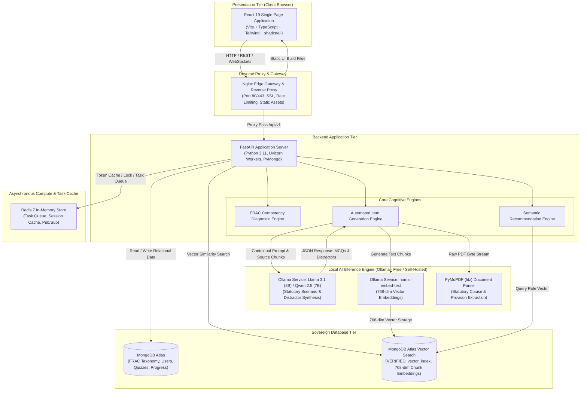
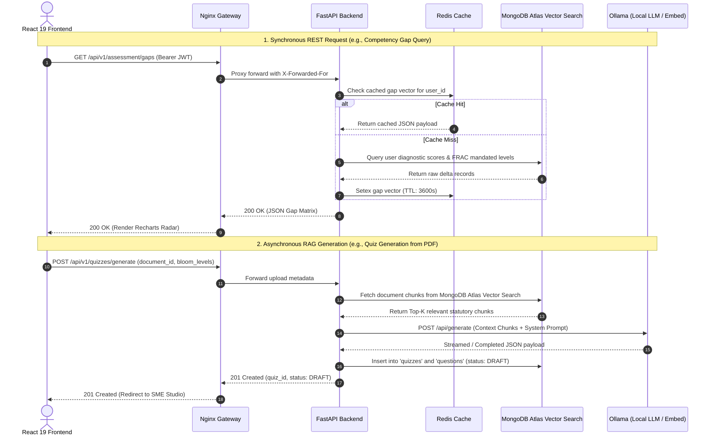

# 01_System_Architecture.md

# System Architecture Document: AI Karmayogi

**Enterprise Architecture, Component Topology, AI Pipeline, and Service Communication for Mission Karmayogi**

**Document Version:** 1.0.0  
**Target Program:** Smart India Hackathon 2026  
**Problem Statement ID:** SIH26101  
**Project Name:** AI Karmayogi  
**Classification:** Enterprise Government Specification — Phase 2 System Design  

---

## Table of Contents
1. [Architectural Overview & Design Principles](#1-architectural-overview--design-principles)
2. [High-Level Architecture Topology](#2-high-level-architecture-topology)
3. [Component Architecture & Technology Stack](#3-component-architecture--technology-stack)
4. [Autonomous AI Pipeline Architecture](#4-autonomous-ai-pipeline-architecture)
5. [Service Communication & Data Exchange Protocols](#5-service-communication--data-exchange-protocols)
6. [Security, Concurrency & High Availability](#6-security-concurrency--high-availability)

---

## 1. Architectural Overview & Design Principles

**AI Karmayogi** is architected as a sovereign, containerized, microservices-oriented capacity building platform. Aligned with Phase 1 specifications, the system delivers three cognitive capabilities:
1. Dynamic competency gap analysis against the **Framework of Roles, Activities, and Competencies (FRAC)**.
2. Contextual, explainable course recommendations linking identified deficits to **iGOT Karmayogi** courses.
3. Automated Item Generation (AIG) extracting scenario-based Multiple Choice Questions (MCQs) across **Bloom’s Revised Taxonomy** from uploaded sovereign government collateral (PDFs, Acts, Circulars).

### Core Architectural Principles:
- **100% Free & Open-Source Software (FOSS):** Zero dependency on commercial SaaS APIs (No OpenAI, No Pinecone, No AWS/Firebase).
- **Sovereign Data Confinement:** All LLM inference (Ollama), vector embeddings, and relational data remain strictly within the self-hosted deployment perimeter.
- **Decoupled Asynchronous Processing:** Heavy PDF parsing and LLM generation tasks are offloaded asynchronously to prevent blocking user-facing HTTP request/response loops.
- **Stateless Application Layer:** Backend FastAPI services are stateless, scaling horizontally behind an Nginx reverse proxy.

---

## 2. High-Level Architecture Topology

The following diagram illustrates the interaction between the presentation tier, API gateway, core backend services, local AI inference tier, and sovereign data storage layers.

---

## 3. Component Architecture & Technology Stack

The platform components are strictly configured around the mandatory free and open-source stack:

| Tier | Component / Technology | Specification & Role in AI Karmayogi |
| :--- | :--- | :--- |
| **Frontend** | **React 19 + TypeScript** | Modern component-driven UI ensuring strict type-safety across user sessions. |
| | **Vite** | Next-generation build tooling delivering optimized HMR and sub-second asset bundling. |
| | **Tailwind CSS + shadcn/ui** | Accessible, GIGW-compliant government design system supporting WCAG 2.1 AA. |
| | **React Router v6** | Declarative client-side routing with role-based route protection guards. |
| | **TanStack Query (React Query)** | Robust server-state caching, background re-fetching, and optimistic mutations. |
| | **Recharts** | Interactive SVG visualizations for FRAC competency gap radar charts and heatmaps. |
| **Edge / Gateway** | **Nginx** | Reverse proxy managing SSL termination, gzip/brotli compression, and rate limiting. |
| **Backend** | **FastAPI** | High-concurrency asynchronous ASGI Python framework with Pydantic v2 validation. |
| | **PyMongo (Async)** | Asynchronous MongoDB driver.
| | **Redis 7** | In-memory key-value cache for session blacklists, rate limits, and task state tracking. |
| **Cognitive AI** | **PyMuPDF (fitz)** | High-speed, local C-based PDF parsing engine preserving structural legal provisos. |
| | **LangChain (Community)** | Orchestrator for structured prompt chains, output parsing, and RAG pipelines. |
| | **Ollama (Local LLM)** | Self-hosted inference server executing open-weights models (`llama3.1:8b` / `qwen2.5:7b`). |
| | **nomic-embed-text** | Local high-performance 768-dimensional text embedding model running via Ollama. |
| **Database** | **MongoDB Atlas** | Scalable document database storing users, FRAC taxonomy, and quizzes.
| | **MongoDB Atlas Vector Search** | Native vector storage utilizing Hierarchical Navigable Small World (HNSW) indexing. |

---

## 4. Autonomous AI Pipeline Architecture

The AI subsystem executes two core cognitive operations: **Document-to-Quiz Synthesis (RAG + AIG)** and **Semantic Competency Gap Matching**.

```mermaid
flowchart TD
    subgraph Ingestion_Pipeline ["1. Document Ingestion & Chunking"]
        PDF["Government Collateral PDF<br/>(Act / Circular / OM / Manual)"] --> Fitz["PyMuPDF Document Extractor"]
        Fitz --> RawText["Extracted Text Stream with Page Metadata"]
        RawText --> Chunker["Statutory Recursive Chunker<br/>(Preserves Sections, Rules, Provisos)"]
        Chunker --> Chunks["Text Chunks<br/>(512 Tokens + 64 Token Overlap)"]
    end

    subgraph Embedding_Pipeline ["2. Local Vector Generation & Storage"]
        Chunks --> OllamaEmbedClient["Ollama nomic-embed-text<br/>(Local API)"]
        OllamaEmbedClient --> Embeddings["768-Dimensional Dense Vectors"]
        Embeddings --> MongoDBVectorStore[("MongoDB Atlas Vector Search")]
    end

    subgraph Generation_Pipeline ["3. Psychometric Item Synthesis (AIG)"]
        MongoDBVectorStore --> Retriever["Top-K Semantic Chunk Retrieval<br/>(Target Topic / Competency)"]
        Retriever --> PromptTemplate["LangChain Structured Prompt<br/>(Enforces Bloom's Taxonomy & Rules)"]
        PromptTemplate --> OllamaLLM["Ollama Llama 3.1 / Qwen 2.5<br/>(Local LLM Inference)"]
        OllamaLLM --> PydanticParser["Pydantic JSON Output Parser"]
        PydanticParser --> RawQuestions["Structured Assessment Items<br/>(Stem, 1 Key, 3 Distractors, Rationale)"]
    end

    subgraph Human_In_Loop ["4. SME Verification & Publishing"]
        RawQuestions --> SMEDashboard["Trainer / SME Review Studio"]
        SMEDashboard -->|Approve / Edit / Regenerate| VerifiedQuiz["Verified Accredited Quiz Bank"]
        VerifiedQuiz --> LiveDelivery["iGOT Active Learner Delivery"]
    end
```

### Key Engineering Attributes of the AI Pipeline:
1. **Statutory Preservation Splitter:** Standard sentence splitters break legal provisos mid-clause. The custom chunker uses regex delimiters matching Indian legal structures (`Section \d+`, `Rule \d+`, `Provided that`, `Sub-clause \([a-z]\)`).
2. **Deterministic JSON Schema Enforcement:** Prompts mandate strict JSON output conforming to a Pydantic schema containing `question_stem`, `options` (array of 4), `correct_key_index`, `bloom_level`, `procedural_rationale`, and `source_citation`.
3. **Plausible Distractor Injection:** The LLM is conditioned with common bureaucratic error templates (e.g., tender threshold miscalculations, improper delegation of financial powers) to synthesize authentic distractors.

---

## 5. Service Communication & Data Exchange Protocols

Inter-service communication is designed for low latency, fault tolerance, and security:

---

## 6. Security, Concurrency & High Availability

| Security / Concurrency Vector | Implementation Architecture |
| :--- | :--- |
| **Authentication & RBAC** | Stateless JWT (HMAC-SHA256) with role claims (`learner`, `trainer`, `department_head`, `administrator`). Redis blacklist for instant token revocation upon logout. |
| **Data Encryption at Rest & Transit** | TLS 1.3 enforced at Nginx edge. Database volumes encrypted at block level via LUKS/dm-crypt on host OS. |
| **Local LLM Isolation** | Ollama binds strictly to Docker internal bridge network (`ai_network`). Port 11434 is never exposed to the public internet or external host interfaces. |
| **Vector Search Indexing** | `MongoDB Atlas Vector Search` HNSW indexes (`m = 16, ef_construction = 64`) ensure vector search latency < 15ms across 500,000 document chunks. |
| **Horizontal Scalability** | FastAPI Uvicorn workers scale across CPU cores (`workers = (2 * cores) + 1`). MongoDB Atlas connection pooling managed via PyMongo pooling.

---
*End of System Architecture*
