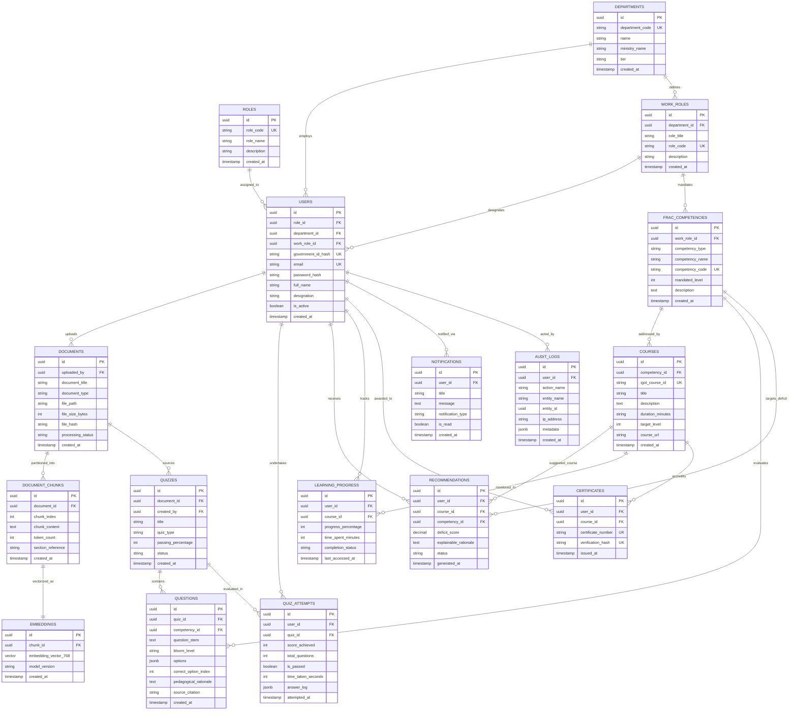

# 02_ER_Diagram.md

# Entity-Relationship (ER) Architecture: AI Karmayogi

**Complete Relational Model, Cardinality Mappings, Foreign Key Schematics, and Mermaid ERD for Mission Karmayogi**

**Document Version:** 1.0.0  
**Target Program:** Smart India Hackathon 2026  
**Problem Statement ID:** SIH26101  
**Project Name:** AI Karmayogi  
**Classification:** Enterprise Government Specification — Phase 2 Data Architecture  

---

## Table of Contents
1. [Data Architecture Overview](#1-data-architecture-overview)
2. [Complete Entity-Relationship Diagram (Mermaid)](#2-complete-entity-relationship-diagram-mermaid)
3. [Entity Descriptions & Domain Boundaries](#3-entity-descriptions--domain-boundaries)
4. [Cardinality & Relationship Matrix](#4-cardinality--relationship-matrix)
5. [Integrity Constraints & Indexing Strategy](#5-integrity-constraints--indexing-strategy)

---

## 1. Data Architecture Overview

The **AI Karmayogi** data layer is structured around an ACID-compliant MongoDB Atlas relational database extended with the **Atlas Vector Search** module. The schema is normalized (3NF) to guarantee transactional consistency while supporting high-throughput vector similarity lookups.

All primary keys use universally unique identifiers (**UUID v4**) to allow distributed key generation, prevent sequential key enumeration attacks, and ensure seamless synchronization across future federal state nodes.

The data model is partitioned into four logical clusters:
1. **Administrative & Identity Cluster:** `roles`, `departments`, `work_roles`, `users`.
2. **Competency & Learning Cluster:** `frac_competencies`, `courses`, `recommendations`, `learning_progress`, `certificates`.
3. **Cognitive AI & Document Cluster:** `documents`, `document_chunks`, `embeddings`.
4. **Pedagogical Assessment & Governance Cluster:** `quizzes`, `questions`, `quiz_attempts`, `notifications`, `audit_logs`.

---

## 2. Complete Entity-Relationship Diagram (Mermaid)

---

## 3. Entity Descriptions & Domain Boundaries

### 1. Administrative & Identity Cluster
- **ROLES:** Authoritative system access permissions (`learner`, `trainer`, `department_head`, `administrator`).
- **DEPARTMENTS:** Government administrative divisions (Central Ministries, Attached Directorates, State Departments).
- **WORK_ROLES:** Specific Work-Based Roles (WBRs) defined under Mission Karmayogi (e.g., Drawing & Disbursing Officer, Section Officer).
- **USERS:** Civil servants, trainers, administrators, and leadership personnel authenticated into the system.

### 2. Competency & Learning Cluster
- **FRAC_COMPETENCIES:** Standardized behavioral, functional, and domain capability nodes, each mapped with mandatory proficiency levels (1 to 5).
- **COURSES:** Curated courses and micro-modules available on the iGOT Karmayogi platform.
- **RECOMMENDATIONS:** Algorithmic learning pathways prescribed to close diagnosed competency gaps with explicit administrative justifications.
- **LEARNING_PROGRESS:** Granular tracking of user completion, interaction time, and module status.
- **CERTIFICATES:** Digitally verifiable micro-credentials issued upon validated competency attainment.

### 3. Cognitive AI & Document Cluster
- **DOCUMENTS:** Raw government regulatory texts, Acts, Rules, circulars, and training PDFs uploaded for processing.
- **DOCUMENT_CHUNKS:** Semantically coherent text segments preserving statutory sections, provisos, and legal sub-clauses.
- **EMBEDDINGS:** Dense 768-dimensional mathematical vector representations generated by `nomic-embed-text` for vector similarity matching in `Atlas Vector Search`.

### 4. Assessment & Governance Cluster
- **QUIZZES:** Formative assessments, baseline diagnostics, and module quizzes generated from documents.
- **QUESTIONS:** Psychometrically structured evaluation items specifying Bloom’s Taxonomy level, 4 options, distractors, and remediation citations.
- **QUIZ_ATTEMPTS:** Immutable logs of civil servant assessment submissions, response choices, and timing metrics.
- **NOTIFICATIONS:** In-app and push triggers informing users of gap closures, new circular quizzes, and course recommendations.
- **AUDIT_LOGS:** Non-repudiable audit trails recording every security, authentication, and content publication event.

---

## 4. Cardinality & Relationship Matrix

| Primary Entity (1) | Related Entity (Many) | Relationship | Cardinality | Business Rule & Governance Constraint |
| :--- | :--- | :--- | :---: | :--- |
| **ROLES** | **USERS** | Assigned To | 1 : N | Every user must possess exactly one active system role. |
| **DEPARTMENTS** | **USERS** | Employs | 1 : N | A user belongs to one administrative department or ministry. |
| **DEPARTMENTS** | **WORK_ROLES** | Defines | 1 : N | A department establishes multiple specialized Work-Based Roles (WBRs). |
| **WORK_ROLES** | **FRAC_COMPETENCIES** | Mandates | 1 : N | Each WBR requires a set of behavioral, functional, and domain competencies. |
| **DOCUMENTS** | **DOCUMENT_CHUNKS** | Partitioned Into | 1 : N | A document is split into ordered, overlapping statutory chunks. |
| **DOCUMENT_CHUNKS** | **EMBEDDINGS** | Vectorized As | 1 : 1 | Each chunk possesses exactly one 768-dim vector embedding. |
| **DOCUMENTS** | **QUIZZES** | Sources | 1 : N | Multiple quizzes (baseline, formative, comprehensive) can derive from one document. |
| **QUIZZES** | **QUESTIONS** | Contains | 1 : N | A quiz contains an ordered sequence of scenario MCQs. |
| **FRAC_COMPETENCIES** | **QUESTIONS** | Evaluates | 1 : N | Every question directly assesses an explicit FRAC competency node. |
| **USERS** | **QUIZ_ATTEMPTS** | Undertakes | 1 : N | A user may attempt a quiz multiple times to demonstrate competency remediation. |
| **USERS** | **RECOMMENDATIONS** | Receives | 1 : N | A user receives targeted recommendations matching their current deficit vectors. |
| **USERS** | **LEARNING_PROGRESS** | Tracks | 1 : N | Tracks real-time engagement and completion across multiple iGOT courses. |
| **USERS** | **CERTIFICATES** | Awarded To | 1 : N | A user earns immutable certificates upon passing accredited competency thresholds. |
| **USERS** | **AUDIT_LOGS** | Acted By | 1 : N | Every administrative and authoring action is captured for non-repudiation. |

---

## 5. Integrity Constraints & Indexing Strategy

1. **Foreign Key Cascades:**
   - Deleting a `DOCUMENT` cascades to delete associated `DOCUMENT_CHUNKS` and `EMBEDDINGS`.
   - Deleting a `QUIZ` cascades to delete associated `QUESTIONS`.
   - User references in `AUDIT_LOGS` are set to `ON DELETE RESTRICT` to preserve legal audit trails.
2. **Unique Business Keys:**
   - `roles(role_code)`, `departments(department_code)`, `work_roles(role_code)`.
   - `frac_competencies(competency_code)`, `courses(igot_course_id)`.
   - `certificates(certificate_number, verification_hash)`.
3. **Optimized Indexes:**
   - Standard B-tree indexes on foreign keys (`user_id`, `course_id`, `quiz_id`, `document_id`).
   - Composite B-tree index on `quiz_attempts(user_id, quiz_id, attempted_at)`.
   - **HNSW Cosine Vector Index** on `embeddings(embedding_vector_768)` for sub-15ms nearest neighbor searches.

---
*End of ER Diagram Specification*
