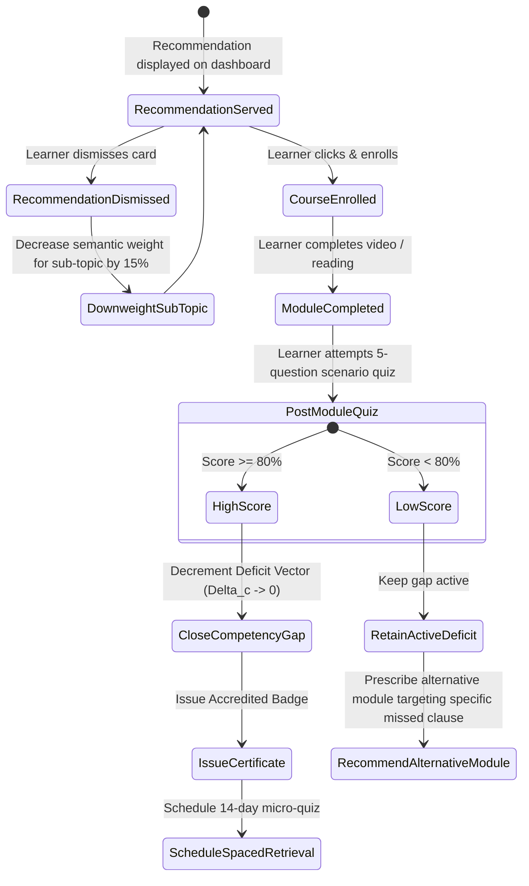
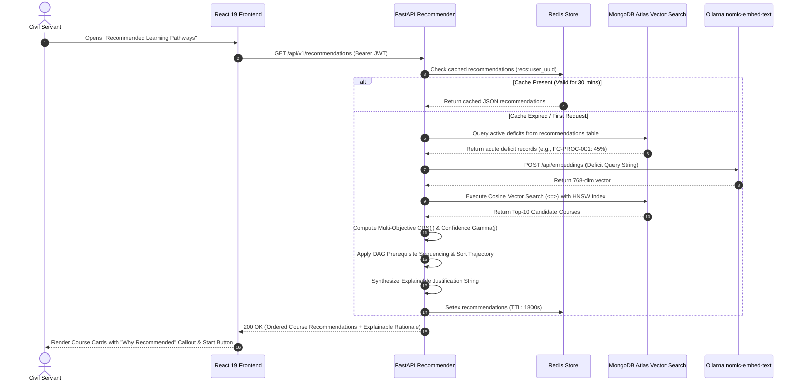

# 02_Recommendation_Engine.md

# Semantic Recommendation Engine: AI Karmayogi

**Hyper-Personalized Course Curation, Multi-Objective Ranking Algorithms, Vector Knowledge Graphs, and Continuous Pedagogical Feedback Loops**

**Document Version:** 1.0.0  
**Target Program:** Smart India Hackathon 2026  
**Problem Statement ID:** SIH26101  
**Project Name:** AI Karmayogi  
**Classification:** Enterprise Government Specification — Phase 3 AI Engine  

---

## Table of Contents
1. [Personalized Recommendation Architecture](#1-personalized-recommendation-architecture)
2. [Semantic Similarity Search Workflow (Atlas Vector Search + nomic-embed-text)](#2-semantic-similarity-search-workflow-Atlas Vector Search--nomic-embed-text)
3. [Role-Based Learning Pathway Generation](#3-role-based-learning-pathway-generation)
4. [Multi-Objective Course Ranking Algorithm](#4-multi-objective-course-ranking-algorithm)
5. [Confidence Scoring & Recommendation Calibration](#5-confidence-scoring--recommendation-calibration)
6. [Cold-Start Resolution Strategy](#6-cold-start-resolution-strategy)
7. [Continuous Feedback & Pedagogical Reinforcement Loop](#7-continuous-feedback--pedagogical-reinforcement-loop)
8. [Mermaid System Architecture & Execution Diagrams](#8-mermaid-system-architecture--execution-diagrams)

---

## 1. Personalized Recommendation Architecture

The **AI Karmayogi Recommendation Engine** eliminates catalog fatigue across the thousands of courses hosted on the **iGOT Karmayogi** ecosystem. Rather than relying on simple popularity metrics or top-down broadcast notices, the engine constructs a dynamic, multidimensional learning trajectory tailored to each civil servant's active **Work-Based Role (WBR)** and diagnosed **FRAC Competency Deficits**.

```
+----------------------------------------------------------------------------------------------------+
|                               RECOMMENDATION ENGINE TOPOLOGY                                       |
+----------------------------------------------------------------------------------------------------+
|                                                                                                    |
|  [ STAGE 1: DEFICIT VECTOR EXTRACTION ]                                                            |
|  * Ingests Competency Deficit Matrix (Delta_c, D_pct) from Diagnostic Engine.                      |
|                                         |                                                          |
|                                         v                                                          |
|  [ STAGE 2: SEMANTIC RETRIEVAL VIA PGVECTOR ]                                                      |
|  * Embeds deficit concepts via nomic-embed-text (768 dimensions).                                  |
|  * Executes Top-K Cosine Nearest Neighbor search against iGOT course embeddings.                   |
|                                         |                                                          |
|                                         v                                                          |
|  [ STAGE 3: MULTI-OBJECTIVE RANKING & PREREQUISITE FILTERING ]                                     |
|  * Blends Deficit Severity, Semantic Cosine Similarity, Duration Efficiency, and Cadre Rating.    |
|  * Enforces DAG (Directed Acyclic Graph) prerequisite sequencing.                                  |
|                                         |                                                          |
|                                         v                                                          |
|  [ STAGE 4: EXPLAINABLE RATIONALE SYNTHESIS ]                                                      |
|  * Injects administrative desk context ("Why Recommended").                                        |
|  * Delivers ordered micro-modules (< 20 mins) directly to learner's workspace.                     |
|                                                                                                    |
+----------------------------------------------------------------------------------------------------+
```

---

## 2. Semantic Similarity Search Workflow (Atlas Vector Search + nomic-embed-text)

Every course on iGOT is indexed in the MongoDB Atlas `embeddings` table by encoding its title, syllabus, learning outcomes, and target FRAC competency code into a dense 768-dimensional vector using the local `nomic-embed-text` model.

### 1. Vector Encoding Pipeline:
When a civil servant presents an acute deficit in a competency (e.g., $D_{\text{pct}} \ge 40\%$ in `FC-PROC-001` - GFR Rule 166 Proprietary Articles), the engine constructs a semantic search query string:

$$\text{Query Text} = \text{"Target Competency: Public Procurement GFR 166. Remediate deficit in proprietary single tender purchase thresholds."}$$

The query is passed locally to Ollama:

$$\vec{V}_{\text{query}} = \text{Ollama}_{\text{embed}}(\text{Query Text}) \in \mathbb{R}^{768}$$

### 2. High-Speed Vector Retrieval via Atlas Vector Search HNSW:
The engine queries MongoDB Atlas using the Cosine Distance operator (`<=>`):

```sql
SELECT 
    c.id AS course_id,
    c.igot_course_id,
    c.title,
    c.duration_minutes,
    c.target_level,
    1 - (e.embedding_vector_768 <=> :query_vector) AS semantic_similarity
FROM courses c
JOIN frac_competencies fc ON c.competency_id = fc.id
JOIN embeddings e ON e.chunk_id = c.id
WHERE c.is_published = TRUE
  AND fc.competency_code = :target_competency_code
ORDER BY e.embedding_vector_768 <=> :query_vector ASC
LIMIT 10;
```

---

## 3. Role-Based Learning Pathway Generation

Government officials cannot afford to take random, disconnected courses. Learning must be organized into a structured **Directed Acyclic Graph (DAG)** of competencies, ensuring foundational statutory knowledge precedes advanced administrative decision-making.

```
+----------------------------------------------------------------------------------------------------+
|                                    COMPETENCY PREREQUISITE DAG                                     |
+----------------------------------------------------------------------------------------------------+
|                                                                                                    |
|    [ FOUNDATION: Level 1 ]                                                                         |
|    "Overview of GFR 2017 & Public Procurement Principles" (15 Mins)                                |
|                        |                                                                           |
|                        v                                                                           |
|    [ INTERMEDIATE: Level 2 ]                                                                       |
|    "GeM Portal Operations: Direct Purchase & L-1 Comparison" (20 Mins)                             |
|                        |                                                                           |
|                        v                                                                           |
|    [ ADVANCED APPLICATION: Level 3 ]                                                               |
|    "Handling Proprietary Bids & Rule 166 Single Tender Exceptions" (18 Mins)                       |
|                        |                                                                           |
|                        v                                                                           |
|    [ EXECUTIVE MASTERY: Level 4 ]                                                                  |
|    "Arbitration, Liquidated Damages & Contract Dispute Resolution" (25 Mins)                       |
|                                                                                                    |
+----------------------------------------------------------------------------------------------------+
```

### Topological Trajectory Sorting Algorithm:
```python
def generate_learning_trajectory(
    candidate_courses: list[dict],
    user_demonstrated_level: int,
    user_mandated_level: int
) -> list[dict]:
    """
    Filters and sequences courses strictly from demonstrated level to mandated level.
    """
    filtered = [
        c for c in candidate_courses 
        if user_demonstrated_level < c["target_level"] <= user_mandated_level
    ]
    # Sort strictly by increasing target competency level, then by duration
    trajectory = sorted(filtered, key=lambda x: (x["target_level"], x["duration_minutes"]))
    return trajectory
```

---

## 4. Multi-Objective Course Ranking Algorithm

To determine the final priority order of recommended courses, the engine computes a composite **Course Priority Score (CPS)** for each candidate course $j$:

$$\text{CPS}(j) = \omega_{\text{sim}} \cdot S_{\text{sim}}(j) + \omega_{\text{def}} \cdot S_{\text{def}}(j) + \omega_{\text{dur}} \cdot S_{\text{dur}}(j) + \omega_{\text{cad}} \cdot S_{\text{cad}}(j)$$

Where:
- $S_{\text{sim}}(j) \in [0, 1]$: Cosine semantic similarity score between query deficit and course vector.
- $S_{\text{def}}(j) = \frac{D_{\text{pct}}(c_j)}{100} \in [0, 1]$: Normalized deficit score of the competency addressed by course $j$.
- $S_{\text{dur}}(j) \in [0, 1]$: Micro-learning duration efficiency score, favoring shorter, highly focused modules:
  $$S_{\text{dur}}(j) = \begin{cases}
  1.0 & \text{if } t_j \le 20 \text{ minutes} \\
  e^{-\frac{t_j - 20}{40}} & \text{if } t_j > 20 \text{ minutes}
  \end{cases}$$
- $S_{\text{cad}}(j) \in [0, 1]$: Peer completion score within the same cadre/department (collaborative filter proxy).

### Standardized Model Weight Coefficients:

| Parameter | Symbol | Production Weight | Rationale |
| :--- | :---: | :---: | :--- |
| **Deficit Severity** | $\omega_{\text{def}}$ | **0.40** | Closing acute capability gaps is the primary institutional mandate of Mission Karmayogi. |
| **Semantic Similarity** | $\omega_{\text{sim}}$ | **0.30** | Guarantees the course content precisely matches the specific statutory sub-topic. |
| **Duration Efficiency** | $\omega_{\text{dur}}$ | **0.20** | Prioritizes micro-modules (< 20 mins) to accommodate high daily file workloads. |
| **Cadre Peer Completion** | $\omega_{\text{cad}}$ | **0.10** | Rewards modules validated as helpful by peer officers in the same Ministry. |

$$\sum \omega = 0.40 + 0.30 + 0.20 + 0.10 = 1.00$$

---

## 5. Confidence Scoring & Recommendation Calibration

Every recommendation is assigned a calibrated **Confidence Score** $\Gamma \in [0, 100\%]$:

$$\Gamma(j) = \left( \text{CPS}(j) \cdot \sqrt{\frac{N_{\text{eval}}}{N_{\text{eval}} + 5}} \right) \times 100\%$$

Where $N_{\text{eval}}$ is the number of diagnostic items completed by the learner for that competency. This Bayesian adjustment penalizes recommendations based on sparse diagnostic data.

### Presentation Tiers:
- **$\Gamma \ge 80\%$ (High Confidence - Top Banner):** *"Critical Desk Priority — Directly targets your primary functional deficit."*
- **$60\% \le \Gamma < 80\%$ (Medium Confidence - Recommended):** *"Targeted Skill Enhancement — Recommended to bridge emerging capability gaps."*
- **$\Gamma < 60\%$ (Low Confidence - Supplementary):** *"Supplementary Learning — Optional elective for general professional development."*

---

## 6. Cold-Start Resolution Strategy

When a newly appointed or transferred officer accesses the platform without any prior assessment history or diagnostic telemetry, the system applies a three-tiered heuristic resolution:

```
+----------------------------------------------------------------------------------------------------+
|                                    COLD-START RESOLUTION FLOW                                      |
+----------------------------------------------------------------------------------------------------+
|                                                                                                    |
|    [ STEP 1: DESK PROFILE HEURISTIC ]                                                              |
|    Query work_role_id from SSO. Retrieve mandated Level 3-4 competencies for that role.            |
|    Prescribe 1 foundational micro-module for the top functional competency (e.g., GFR for DDO).     |
|                                                                                                    |
|    [ STEP 2: PEER CADRE COLLABORATIVE POPULARITY ]                                                 |
|    Identify top 3 highest-rated micro-courses completed by peers with the same designation         |
|    within the same Ministry over the past 90 days.                                                 |
|                                                                                                    |
|    [ STEP 3: EMBEDDED DIAGNOSTIC ONBOARDING PROMPT ]                                               |
|    Present non-intrusive 5-minute "Role Readiness Diagnostic" banner on the home screen.           |
|    Once completed, immediately overwrite cold-start heuristics with high-precision vectors.         |
|                                                                                                    |
+----------------------------------------------------------------------------------------------------+
```

---

## 7. Continuous Feedback & Pedagogical Reinforcement Loop

The recommendation engine is not static; it dynamically recalculates learning priorities upon every interaction:



---

## 8. Mermaid System Architecture & Execution Diagrams

### Real-Time Recommendation Query Sequence



---
*End of Recommendation Engine Specification*
