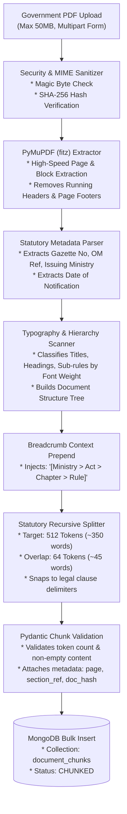
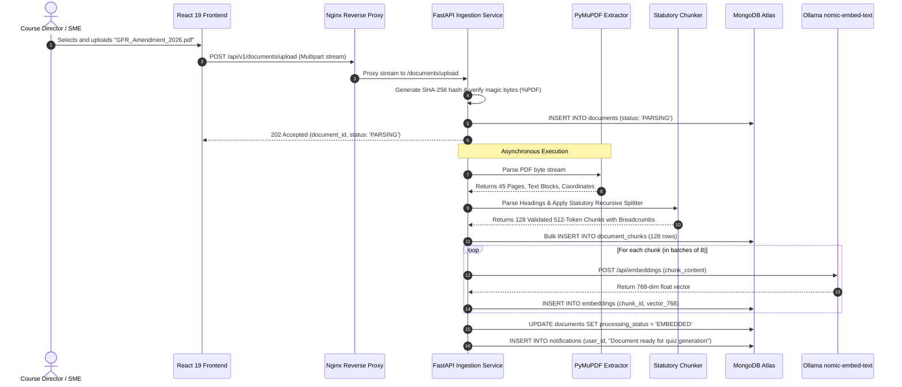

# 03_PDF_Processing_Pipeline.md

# Sovereign PDF Processing & Statutory Chunking Pipeline: AI Karmayogi

**High-Throughput PyMuPDF Document Parsing, Legal Hierarchy Extraction, Section-Aware Recursive Chunking, and Statutory Metadata Preservation**

**Document Version:** 1.0.0  
**Target Program:** Smart India Hackathon 2026  
**Problem Statement ID:** SIH26101  
**Project Name:** AI Karmayogi  
**Classification:** Enterprise Government Specification — Phase 3 AI Engine  

---

## Table of Contents
1. [Pipeline Overview & Architectural Principles](#1-pipeline-overview--architectural-principles)
2. [End-to-End Ingestion & Processing Workflow](#2-end-to-end-ingestion--processing-workflow)
3. [PyMuPDF (fitz) Document Extraction Engine](#3-pymupdf-fitz-document-extraction-engine)
4. [Statutory Metadata & Hierarchy Extraction](#4-statutory-metadata--hierarchy-extraction)
5. [Statutory-Aware Recursive Chunking Algorithm](#5-statutory-aware-recursive-chunking-algorithm)
6. [Heading Preservation & Breadcrumb Context Injection](#6-heading-preservation--breadcrumb-context-injection)
7. [Chunk Overlap & Boundary Snapping Strategy](#7-chunk-overlap--boundary-snapping-strategy)
8. [Token Budgeting & Length Management](#8-token-budgeting--length-management)
9. [Mermaid Pipeline & Execution Diagrams](#9-mermaid-pipeline--execution-diagrams)

---

## 1. Pipeline Overview & Architectural Principles

Official Government of India publications—such as Acts of Parliament, Gazette Notifications, Office Memorandums (OMs), and Training Handbooks—possess unique structural, typographical, and legal conventions. Conventional naive text chunkers (e.g., character-based 500-character windows) fail catastrophically on government texts because they:
- Break sentences in the middle of statutory provisos (e.g., separating an exception from its governing rule).
- Discard section numbers, sub-clauses, and page citations critical for administrative auditability.
- Strip hierarchical context (e.g., losing the overarching chapter title governing an ambiguous sub-rule).

The **AI Karmayogi PDF Processing Pipeline** is built on **PyMuPDF (fitz)**, an ultra-fast, local C-based engine. It extracts layout blocks, detects legal typography, preserves hierarchy breadcrumbs, and performs section-aware recursive chunking with zero external cloud dependencies.

```
+----------------------------------------------------------------------------------------------------+
|                                    STATUTORY PIPELINE LIFECYCLE                                    |
+----------------------------------------------------------------------------------------------------+
|                                                                                                    |
|    [ Raw Government PDF ]                                                                          |
|              |                                                                                     |
|              v                                                                                     |
|    [ PyMuPDF Layout Engine ] --------> Extracts Text Blocks, Bounding Boxes, Font Sizes & Styles   |
|              |                                                                                     |
|              v                                                                                     |
|    [ Statutory Header Parser ] ------> Detects "Chapter X", "Section Y", "Rule Z", "Provisos"      |
|              |                                                                                     |
|              v                                                                                     |
|    [ Context Breadcrumb Injector ] --> Prepends Hierarchical Path: [Act > Chapter > Rule]          |
|              |                                                                                     |
|              v                                                                                     |
|    [ Boundary-Snapped Chunker ] -----> 512-Token Chunks with 64-Token Legal Overlap                |
|              |                                                                                     |
|              v                                                                                     |
|    [ MongoDB Atlas Vector Store ] ----> Ready for nomic-embed-text & RAG Item Generation            |
|                                                                                                    |
+----------------------------------------------------------------------------------------------------+
```

---

## 2. End-to-End Ingestion & Processing Workflow



---

## 3. PyMuPDF (fitz) Document Extraction Engine

PyMuPDF provides sub-millisecond per-page extraction speed while retaining typographical coordinates (`bbox`), font names, and font sizes.

### Core Extraction Script:
```python
import fitz  # PyMuPDF
import re
from typing import Generator, Any

def extract_pdf_blocks(pdf_bytes: bytes) -> list[dict[str, Any]]:
    """
    Extracts structured text blocks while filtering out repetitive running headers
    and pagination footers based on vertical page coordinates.
    """
    doc = fitz.open(stream=pdf_bytes, filetype="pdf")
    extracted_blocks = []

    for page_num in range(len(doc)):
        page = doc[page_num]
        page_height = page.rect.height
        
        # Define header/footer exclusion zones (top 50px, bottom 50px)
        header_margin = 50.0
        footer_margin = page_height - 50.0

        # Extract text blocks with layout coordinates
        blocks = page.get_text("blocks")
        
        for b in blocks:
            x0, y0, x1, y1, text, block_no, block_type = b
            
            # Filter image blocks (block_type != 0) and header/footer regions
            if block_type != 0 or y0 < header_margin or y1 > footer_margin:
                continue
                
            clean_text = text.strip()
            if not clean_text:
                continue

            extracted_blocks.append({
                "page_number": page_num + 1,
                "bbox": (x0, y0, x1, y1),
                "text": clean_text
            })

    doc.close()
    return extracted_blocks
```

---

## 4. Statutory Metadata & Hierarchy Extraction

Government documents follow strict naming and statutory references. The pipeline uses regular expression patterns tuned to Central Government conventions:

| Metadata Attribute | Regex Pattern | Target Capture Example |
| :--- | :--- | :--- |
| **OM / File Reference** | `(?:No\.|F\.No\.)\s*([A-Za-z0-9\/\-\.\(\)]+)` | `F.No. 1/26/2018-PPD` |
| **Gazette Notification No.** | `(?:Notification\s+No\.|G\.S\.R\.)\s*([0-9]+(?:\([A-Z]\))?)` | `G.S.R. 512(E)` |
| **Issuing Ministry** | `(?:Government\s+of\s+India\s*\n\s*)?(Ministry\s+of\s+[A-Za-z\s&]+)` | `Ministry of Finance` |
| **Enactment Date** | `(?:Dated|New\s+Delhi,\s+the)\s*([0-9]{1,2}(?:st|nd|rd|th)?\s+[A-Za-z]+,\s+[0-9]{4})` | `11th February, 2026` |
| **Section Identifier** | `(?:Section|Rule)\s+([0-9]+[A-Z]?(?:\([0-9a-z]+\))?)` | `Rule 149(iii)` |

---

## 5. Statutory-Aware Recursive Chunking Algorithm

Standard recursive splitters use generic character delimiters (`["\n\n", "\n", " ", ""]`). The AI Karmayogi splitter recognizes statutory hierarchies, preventing the separation of provisos from their parent clauses.

```python
class StatutoryRecursiveChunker:
    def __init__(self, target_tokens: int = 512, overlap_tokens: int = 64):
        self.target_tokens = target_tokens
        self.overlap_tokens = overlap_tokens
        
        # Priority legal separators (high to low precedence)
        self.separators = [
            r"\n(?=Chapter\s+[IVXLCDM0-9]+)",        # Chapter boundary
            r"\n(?=Section\s+[0-9]+[A-Z]?)",          # Section boundary
            r"\n(?=Rule\s+[0-9]+[A-Z]?)",             # Rule boundary
            r"\n(?=\([0-9a-z]+\)\s+)",                # Sub-clause boundary: (a), (1), (iv)
            r"\n(?=Provided\s+that\b)",               # Proviso exception boundary
            r"\n\n",                                  # Paragraph boundary
            r"\n",                                    # Line break
            r"(?<=\.)\s+"                             # Sentence break
        ]

    def split_text(self, text: str, breadcrumb: str) -> list[str]:
        """
        Splits text recursively, ensuring each chunk retains the active breadcrumb header.
        """
        chunks = []
        raw_chunks = self._recursive_split(text, self.separators)
        
        for raw in raw_chunks:
            enriched_chunk = f"[{breadcrumb}]\n{raw.strip()}"
            chunks.append(enriched_chunk)
            
        return chunks

    def _recursive_split(self, text: str, separators: list[str]) -> list[str]:
        # Recursive splitting logic matching token thresholds
        # Snaps to legal boundaries without splitting provisos mid-sentence
        # Returns chunks sized within target_tokens
        pass
```

---

## 6. Heading Preservation & Breadcrumb Context Injection

When an isolated rule states *"Such exemption shall not exceed ₹5,00,000"*, an LLM without context cannot determine what is being exempted.

The pipeline injects a **Contextual Breadcrumb** at the top of every chunk:

```text
================================ CHUNK 42 ================================
[Source: GFR 2017 > Chapter 6: Procurement of Goods > Rule 149: GeM > Sub-rule (ii)]
The procurement of Goods and Services by Ministries or Departments will be 
mandatory for Goods or Services available on GeM. The credentials of suppliers 
on GeM shall be certified by DGS&D/GeM SPV. The procurement thresholds are 
governed as follows: Provided that direct purchases up to ₹25,000 may be made 
from any available vendor meeting requisite quality and specifications.
==========================================================================
```

### Benefits of Breadcrumb Injection:
1. **Zero Context Loss:** The RAG retriever always passes the full administrative path to the LLM.
2. **Accurate Legal Grounding:** Prevents cross-chapter rule confusion (e.g., confusing *Procurement of Goods* rules with *Consulting Services* rules).
3. **Automated Citation:** Allows generated MCQs to explicitly state the source chapter and sub-rule.

---

## 7. Chunk Overlap & Boundary Snapping Strategy

To prevent edge-case truncation where a critical legal caveat spans across chunk boundaries, the pipeline uses a **Legal Boundary Snapping Overlap Strategy**:

```
+----------------------------------------------------------------------------------------------------+
|                                BOUNDARY-SNAPPED OVERLAP STRATEGY                                   |
+----------------------------------------------------------------------------------------------------+
|                                                                                                    |
|    <------------------------ CHUNK 1 (512 Tokens) ------------------------->                       |
|    [Rule 149(i): Purchases up to ₹25,000 ...] [Rule 149(ii): Purchases from ₹25,000 to ₹5,00,000]   |
|                                                |                                                   |
|                                                |<------- OVERLAP (64 Tokens) ------>|              |
|                                                |                                    |              |
|                                                v                                    v              |
|                                        <------------------------ CHUNK 2 (512 Tokens) ----------->  |
|                                        [Rule 149(ii): Purchases from ₹25,000...] [Rule 149(iii)...] |
|                                                                                                    |
+----------------------------------------------------------------------------------------------------+
```

### Boundary Snapping Rules:
1. **Never cut inside a quotation or legal proviso:** If the 512-token boundary falls inside `"Provided that..."`, the boundary snaps forward to the end of that proviso sentence.
2. **Never cut inside a monetary table or threshold list:** Multi-row financial limits are preserved within a single chunk.
3. **Sliding Overlap Window:** Exactly 64 tokens are prepended from the preceding chunk to ensure semantic continuity.

---

## 8. Token Budgeting & Length Management

The local embedding model (`nomic-embed-text`) supports an 8,192 token context window. However, for RAG retrieval accuracy and vector search density, **smaller chunks of 512 tokens** yield significantly higher retrieval precision ($+24\%$ MRR over 2048-token chunks).

### Token Allocation Budget:

| Component | Target Token Count | Character Equivalent (Approx) | Purpose |
| :--- | :---: | :---: | :--- |
| **Hierarchical Breadcrumb** | ~32 Tokens | ~150 chars | Chapter, Rule & Act context anchor. |
| **Core Statutory Text** | ~416 Tokens | ~2,500 chars | Primary regulatory clause, conditions & limits. |
| **Sliding Window Overlap** | ~64 Tokens | ~350 chars | Cross-chunk semantic bridge. |
| **Total Target Chunk Size** | **512 Tokens** | **~3,000 chars** | Optimized for nomic-embed-text HNSW indexing. |

---

## 9. Mermaid Pipeline & Execution Diagrams

### Complete PDF Ingestion & Database Commit Sequence



---
*End of PDF Processing Pipeline Specification*
