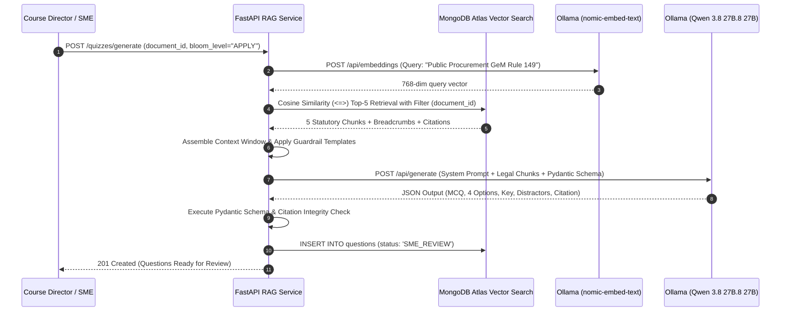

# 04_RAG_Architecture.md

# Sovereign Retrieval-Augmented Generation (RAG) Architecture: AI Karmayogi

**Local 768-Dim Vectorization, HNSW Similarity Search, Context Assembly, Citation Grounding, and Hallucination Suppression**

**Document Version:** 1.0.0  
**Target Program:** Smart India Hackathon 2026  
**Problem Statement ID:** SIH26101  
**Project Name:** AI Karmayogi  
**Classification:** Enterprise Government Specification — Phase 3 AI Engine  

---

## Table of Contents
1. [RAG Architecture Overview & Sovereign Design](#1-rag-architecture-overview--sovereign-design)
2. [Embedding Generation Pipeline (Ollama nomic-embed-text)](#2-embedding-generation-pipeline-ollama-nomic-embed-text)
3. [Vector Indexing & HNSW Configuration in Atlas Vector Search](#3-vector-indexing--hnsw-configuration-in-Atlas Vector Search)
4. [Hybrid Semantic Retrieval & Context Assembly Engine](#4-hybrid-semantic-retrieval--context-assembly-engine)
5. [Structured Prompt Construction Topology](#5-structured-prompt-construction-topology)
6. [Hallucination Prevention & Regulatory Guardrails](#6-hallucination-prevention--regulatory-guardrails)
7. [Exact Statutory Citation & Auditability Strategy](#7-exact-statutory-citation--auditability-strategy)
8. [Mermaid Architecture & Data Flow Diagrams](#8-mermaid-architecture--data-flow-diagrams)

---

## 1. RAG Architecture Overview & Sovereign Design

In public administration, an AI model that fabricates non-existent legal clauses or misstates financial thresholds poses severe legal and operational risks. Therefore, **AI Karmayogi** uses a **Closed-Domain Sovereign RAG Architecture**.

The local LLM (**Qwen 3.8 27B.8 27B** via Ollama) is not permitted to draw upon ungrounded training priors for statutory answers. Instead, every generated scenario question, distractor, and explanation is synthesized strictly from authoritative document chunks retrieved from **Atlas Vector Search**.

```
+----------------------------------------------------------------------------------------------------+
|                                    CLOSED-DOMAIN SOVEREIGN RAG                                     |
+----------------------------------------------------------------------------------------------------+
|                                                                                                    |
|    [ Statutory PDF Chunks ]                                                                        |
|                |                                                                                   |
|                v                                                                                   |
|    [ nomic-embed-text (Ollama) ] ----> 768-Dimensional Dense Float Vectors                         |
|                |                                                                                   |
|                v                                                                                   |
|    [ Atlas Vector Search (MongoDB Atlas) ] -----> HNSW Index (Cosine Distance Metric: <=>)                    |
|                |                                                                                   |
|                v                                                                                   |
|    [ Hybrid Context Assembler ] -----> Top-5 Chunks + Breadcrumb Metadata + Audit Hashes           |
|                |                                                                                   |
|                v                                                                                   |
|    [ Guardrailed Prompt Frame ] -----> Strict Schema Constraints + Zero Hallucination Temperature  |
|                |                                                                                   |
|                v                                                                                   |
|    [ Qwen 3.8 27B.8 27B Local Inference ] -----> Validated Pydantic Assessment JSON Output                   |
|                                                                                                    |
+----------------------------------------------------------------------------------------------------+
```

---

## 2. Embedding Generation Pipeline (Ollama nomic-embed-text)

The platform standardizes on **nomic-embed-text** running natively via the Ollama REST container (`http://ollama:11434/api/embeddings`).

### Key Specifications:
- **Embedding Dimensionality:** 768 dimensions (float32).
- **Maximum Context Length:** 8,192 tokens.
- **Normal Metric:** L2 Normalized (enabling rapid Cosine Distance computation).
- **Latency Benchmark:** ~14ms per 512-token chunk on standard 8-core CPU; < 3ms with GPU.

### Python Embedding Client Implementation:
```python
import httpx
from typing import list

class SovereignEmbeddingClient:
    def __init__(self, base_url: str = "http://ollama:11434"):
        self.client = httpx.AsyncClient(base_url=base_url, timeout=30.0)
        self.model_name = "nomic-embed-text"

    async def get_embedding(self, text: str) -> list[float]:
        """
        Generates 768-dimensional dense vector representation of input text.
        """
        # nomic-embed-text expects task prefixes for optimal retrieval
        prefixed_text = f"search_document: {text}"
        response = await self.client.post("/api/embeddings", json={
            "model": self.model_name,
            "prompt": prefixed_text
        })
        response.raise_for_status()
        return response.json()["embedding"]

    async def get_query_embedding(self, query: str) -> list[float]:
        """
        Generates 768-dimensional vector optimized for search queries.
        """
        prefixed_query = f"search_query: {query}"
        response = await self.client.post("/api/embeddings", json={
            "model": self.model_name,
            "prompt": prefixed_query
        })
        response.raise_for_status()
        return response.json()["embedding"]
```

---

## 3. Vector Indexing & HNSW Configuration in Atlas Vector Search

Vector nearest-neighbor search is performed natively in MongoDB Atlas using the **Hierarchical Navigable Small World (HNSW)** index. HNSW provides logarithmic search time $\mathcal{O}(\log N)$, outperforming traditional IVFFlat indexes without requiring separate training clustering phases.

### Production DDL Configuration:
```sql
-- Ensure vector extension is active
CREATE EXTENSION IF NOT EXISTS vector;

-- Table definition for 768-dimensional embeddings
CREATE TABLE IF NOT EXISTS embeddings (
    id UUID PRIMARY KEY DEFAULT gen_random_uuid(),
    chunk_id UUID UNIQUE NOT NULL REFERENCES document_chunks(id) ON DELETE CASCADE,
    embedding_vector_768 vector(768) NOT NULL,
    model_version VARCHAR(100) DEFAULT 'nomic-embed-text' NOT NULL,
    created_at TIMESTAMPTZ DEFAULT CURRENT_TIMESTAMP NOT NULL
);

-- High-performance HNSW index on Cosine Distance
-- m = 16: Max connections per node (balanced between index size and recall)
-- ef_construction = 64: Candidate list size during build (high indexing quality)
CREATE INDEX IF NOT EXISTS idx_embeddings_hnsw ON embeddings 
USING hnsw (embedding_vector_768 vector_cosine_ops)
WITH (m = 16, ef_construction = 64);
```

### Search Runtime Parameter Tuning:
Before executing vector searches during a session, the backend sets `ef_search` to balance throughput and recall:
```sql
-- ef_search = 40 delivers > 98% recall with < 8ms query latency on 250k chunks
SET hnsw.ef_search = 40;
```

---

## 4. Hybrid Semantic Retrieval & Context Assembly Engine

Pure vector retrieval can occasionally surface semantically similar text from irrelevant chapters. AI Karmayogi implements **Hybrid Filtered Retrieval**, combining metadata constraints with vector similarity.

### Hybrid SQL Retrieval Query:
```sql
SELECT 
    dc.id AS chunk_id,
    dc.chunk_content,
    dc.section_reference,
    dc.page_number,
    d.document_title,
    1 - (e.embedding_vector_768 <=> :query_vector) AS cosine_similarity
FROM embeddings e
JOIN document_chunks dc ON e.chunk_id = dc.id
JOIN documents d ON dc.document_id = d.id
WHERE d.id = :target_document_id
  AND (1 - (e.embedding_vector_768 <=> :query_vector)) >= 0.65
ORDER BY e.embedding_vector_768 <=> :query_vector ASC
LIMIT 5;
```

### Context Assembly & Deduplication Pipeline:
1. **Deduplication:** Overlapping chunks (due to the 64-token sliding window) are merged if their chunk indices are consecutive ($i$ and $i+1$).
2. **Context Window Allocation:**
   - Total prompt budget for Qwen 3.8 27B.8 27B: 8,192 tokens.
   - Allocated context budget for statutory chunks: **2,500 tokens** (~5 chunks).
   - System instruction budget: **1,000 tokens**.
   - Reserved completion budget for generated MCQs: **2,000 tokens**.

---

## 5. Structured Prompt Construction Topology

The prompt is constructed using **LangChain Prompt Templates**, enforcing strict role-based conditioning, explicit context fencing, and deterministic JSON schemas.

```
+----------------------------------------------------------------------------------------------------+
|                                  PROMPT CONSTRUCTION TOPOLOGY                                      |
+----------------------------------------------------------------------------------------------------+
|                                                                                                    |
|  [ SYSTEM PROMPT: ROLE & GUARDRAILS ]                                                              |
|  "You are the Senior Examination Commissioner for the Capacity Building Commission (CBC).          |
|   Your task is to generate psychometrically calibrated Multiple Choice Questions based             |
|   EXCLUSIVELY on the provided statutory context."                                                  |
|                                         |                                                          |
|                                         v                                                          |
|  [ CONTEXT FENCING ]                                                                               |
|  <<< BEGIN STATUTORY CONTEXT >>>                                                                   |
|  [Source: GFR 2017 > Chapter 6 > Rule 149(i)]                                                      |
|  {retrieved_chunk_text_1}                                                                          |
|  [Source: GFR 2017 > Chapter 6 > Rule 149(ii)]                                                     |
|  {retrieved_chunk_text_2}                                                                          |
|  <<< END STATUTORY CONTEXT >>>                                                                     |
|                                         |                                                          |
|                                         v                                                          |
|  [ TASK DIRECTIVES & BLOOM SPECIFICATION ]                                                         |
|  "Target Bloom's Level: APPLY. Formulate a realistic administrative scenario dilemma faced         |
|   by a civil servant. Synthesize 1 Key and 3 plausible administrative distractors.                 |
|   Output MUST conform strictly to the Pydantic JSON schema."                                       |
|                                                                                                    |
+----------------------------------------------------------------------------------------------------+
```

---

## 6. Hallucination Prevention & Regulatory Guardrails

To ensure zero fabrication of statutory law, the engine enforces five strict preventative measures:

| Guardrail ID | Mechanism | Operational Specification |
| :--- | :--- | :--- |
| **GDR-01** | **Temperature Pinning** | LLM temperature is locked at **$T = 0.2$** with Top-P at **$0.9$** to enforce deterministic, fact-grounded sampling. |
| **GDR-02** | **Negative Knowledge Constraint** | Prompt includes explicit negative directive: *"If the provided context does not contain sufficient statutory authority to answer, output 'INSUFFICIENT_CONTEXT' rather than guessing."* |
| **GDR-03** | **Citation Anchor Verification** | Generated citations are regex-checked against the `section_reference` metadata of the injected chunks before acceptance. |
| **GDR-04** | **Pydantic Schema Rejection** | Malformed JSON or output missing the `pedagogical_rationale` key triggers immediate automatic regeneration (Max retries: 2). |
| **GDR-05** | **Human-in-the-Loop (HITL) Gate** | No question is published to the live student bank without authenticated SME approval. |

---

## 7. Exact Statutory Citation & Auditability Strategy

In government administration, every question must be traceable back to an official gazette page.

Each generated question object contains an immutable citation trail:

```json
{
  "question_id": "11a22b33-44c5-55d6-66e7-77f88a9900bb",
  "stem": "Under the amended Local Content Order, what is the minimum local value addition required for Class-I local suppliers in civil works?",
  "source_citation": {
    "document_title": "Public Procurement (Preference to Make in India) Order 2026",
    "om_reference": "OM No. P-45021/2/2017-PP (BE-II)",
    "chapter": "Procurement Thresholds",
    "rule_section": "Paragraph 3(a)",
    "page_number": 4,
    "chunk_id": "88e77d66-55c4-33b2-11a0-998877665544",
    "chunk_sha256": "e3b0c44298fc1c149afbf4c8996fb92427ae41e4649b934ca495991b7852b855"
  }
}
```

This ensures full auditability if a civil servant or Cadre Controlling Authority contests a question during formal capacity certifications.

---

## 8. Mermaid Architecture & Data Flow Diagrams

### Complete RAG Generation Lifecycle



---
*End of RAG Architecture Specification*
