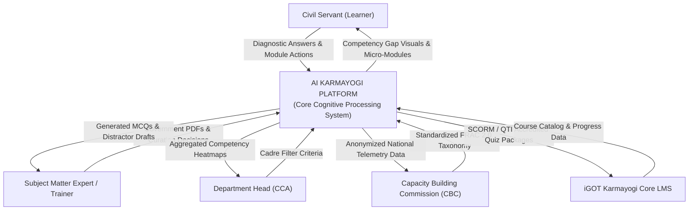
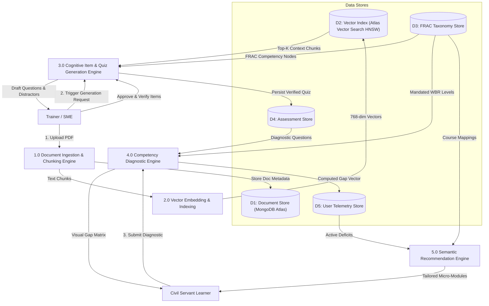

# 05_Data_Flow_Diagram.md

# Data Flow Architecture: AI Karmayogi

**End-to-End Cognitive Data Pipeline: From Sovereign Document Ingestion to Automated Psychometric MCQ Generation**

**Document Version:** 1.0.0  
**Target Program:** Smart India Hackathon 2026  
**Problem Statement ID:** SIH26101  
**Project Name:** AI Karmayogi  
**Classification:** Enterprise Government Specification — Phase 2 Data Engineering  

---

## Table of Contents
1. [Data Pipeline Overview & Architecture](#1-data-pipeline-overview--architecture)
2. [DFD Level 0: Global Context Diagram](#2-dfd-level-0-global-context-diagram)
3. [DFD Level 1: System Process Decomposition](#3-dfd-level-1-system-process-decomposition)
4. [DFD Level 2: Granular AI Processing & Item Generation Pipeline](#4-dfd-level-2-granular-ai-processing--item-generation-pipeline)
5. [Data Transformation Specifications](#5-data-transformation-specifications)
6. [Data Store Schema Mapping](#6-data-store-schema-mapping)

---

## 1. Data Pipeline Overview & Architecture

The core data processing lifecycle of **AI Karmayogi** converts static, unstructured sovereign government collateral (Acts, Rules, Gazette Notifications, Office Memorandums, and Training Handouts) into psychometrically valid, Bloom’s-aligned Multiple Choice Questions (MCQs) and personalized learning recommendations.

The mandatory end-to-end data pipeline is structured as follows:

$$\text{PDF Document} \longrightarrow \text{PyMuPDF Extraction} \longrightarrow \text{Statutory Chunking} \longrightarrow \text{Ollama nomic-embed-text} \longrightarrow \text{Atlas Vector Search Storage} \longrightarrow \text{Ollama Llama 3.1} \longrightarrow \text{MCQ Synthesis}$$

### Key Engineering Guarantees:
- **Zero External Egress:** Every step executes within the containerized boundary.
- **Statutory Context Preservation:** Legal hierarchies and provisos are preserved during text tokenization.
- **Deterministic Schema Parsing:** Pydantic models validate LLM outputs to prevent malformed assessment items.

---

## 2. DFD Level 0: Global Context Diagram

The Level 0 Context Diagram depicts the high-level boundary of the AI Karmayogi platform and its interactions with external administrative entities.



---

## 3. DFD Level 1: System Process Decomposition

The Level 1 DFD decomposes AI Karmayogi into its four core sub-processes: Ingestion & Vectorization, Psychometric Item Synthesis, Competency Diagnostics, and Semantic Recommendations.



---

## 4. DFD Level 2: Granular AI Processing & Item Generation Pipeline

This diagram represents the exact step-by-step transformation: **PDF → PyMuPDF → Chunking → Embeddings → Atlas Vector Search → Ollama → MCQ Generation**.

```mermaid
flowchart TD
    A["Raw Government PDF<br/>(Gazette / Act / Circular)"] --> B["PyMuPDF (fitz) Extractor<br/>* Extracts plain text & layout<br/>* Preserves page numbers & headings"]
    
    B --> C["Statutory Recursive Chunker<br/>* Chunk size: 512 tokens<br/>* Chunk overlap: 64 tokens<br/>* Preserves Section, Rule, Proviso boundaries"]
    
    C --> D["Ollama Embeddings API<br/>* Model: nomic-embed-text<br/>* Output: 768-dim dense float vector"]
    
    D --> E[("MongoDB Atlas Vector Search<br/>* Collection: document_chunks<br/>* Index: Atlas Vector Search (Cosine)")]
    
    E --> F["Semantic Context Retriever<br/>* Input: Competency Code + Bloom Target<br/>* Top-K Cosine Similarity Search (K=5)"]
    
    F --> G["LangChain Prompt Constructor<br/>* Injects retrieved legal chunks<br/>* Enforces Bloom's Taxonomy Level<br/>* Injects Administrative Error Templates"]
    
    G --> H["Ollama Local LLM Inference<br/>* Model: Llama 3.1 (8B) or Qwen 2.5 (7B)<br/>* Temperature: 0.2 (Low hallucination)<br/>* Enforces strict JSON output schema"]
    
    H --> I["Pydantic JSON Parser & Validator<br/>* Validates 1 Key + 3 Distractors<br/>* Validates rationale & citation<br/>* Rejects malformed responses"]
    
    I --> J["Human-in-the-Loop (SME) Review<br/>* Review, edit, or approve item"]
    
    J --> K[("MongoDB Atlas Assessment Tables<br/>* Collection: quizzes<br/>* Collection: questions")]
```



---

## 5. Data Transformation Specifications

### Step 1: PDF to Text Stream (PyMuPDF / fitz)
- **Input:** Binary stream (`.pdf`) from HTTP multipart upload.
- **Process:** `fitz.open(stream=file_bytes)` extracts text blocks while discarding headers, footers, and page numbers.
- **Output:** Clean UTF-8 text string annotated with `{page_number, section_header}`.

### Step 2: Statutory Chunking
- **Algorithm:** Custom Recursive Token Splitter.
- **Parameters:**
  - `chunk_size`: 512 tokens (~350 words).
  - `chunk_overlap`: 64 tokens (~45 words).
  - `separators`: `["\n\nSection ", "\n\nRule ", "\n\nClause ", "\nProvided that ", "\n\n", "\n", " "]`.
- **Output:** Array of text chunks with preserved legal context.

### Step 3: Local Vectorization (nomic-embed-text)
- **Input:** Individual text chunk string.
- **Model:** `nomic-embed-text:latest` executed via Ollama local REST API (`POST http://ollama:11434/api/embeddings`).
- **Output:** 768-dimensional float array (`[-0.0421, 0.0892, ..., 0.0115]`).

### Step 4: Vector Indexing (Atlas Vector Search)
- **Query:** `INSERT INTO embeddings (chunk_id, embedding_vector_768) VALUES ($1, $2)`.
- **Search Metric:** Cosine Distance (`vector_cosine_ops`), queried via the `<=>` operator:
  ```sql
  SELECT chunk_content, 1 - (embedding_vector_768 <=> query_vector) AS similarity
  FROM embeddings JOIN document_chunks ON chunks.id = embeddings.chunk_id
  ORDER BY embedding_vector_768 <=> query_vector ASC LIMIT 5;
  ```

### Step 5: Psychometric MCQ Synthesis (Ollama LLM)
- **Model:** `llama3.1:8b` or `qwen2.5:7b` with temperature `0.2` and deterministic system prompt.
- **Prompt Structure:**
  ```text
  SYSTEM: You are a Senior Civil Service Examination Commissioner. Generate a scenario-based MCQ aligned to Bloom's Level [APPLY] based exclusively on the provided statutory text chunks. Include 1 correct option, 3 plausible administrative distractors, and an explanatory citation. Respond ONLY in valid JSON.
  CONTEXT: [Top-5 Retrieved Statutory Chunks]
  ```
- **Validation:** Pydantic schema validation verifies that `options` has exactly 4 items, `correct_option_index` is between 0 and 3, and `pedagogical_rationale` references the source clause.

---

## 6. Data Store Schema Mapping

| Pipeline Stage | Source Data Entity | Intermediate State | Destination Data Entity |
| :--- | :--- | :--- | :--- |
| **PDF Ingestion** | Multipart File Upload | Temporary memory buffer | `documents` |
| **Chunking** | `documents.file_path` | Memory array of chunks | `document_chunks` |
| **Embeddings** | `document_chunks.chunk_content` | 768-dim float array | `embeddings` |
| **AIG Prompting** | `document_chunks` + `embeddings` | Retrieved Context String | Ollama LLM Inference Context |
| **MCQ Generation** | Ollama LLM JSON Stream | Validated Pydantic Object | `quizzes` & `questions` |
| **Assessment** | User Diagnostic Responses | Scored Answer Log | `quiz_attempts` & `recommendations` |

---
*End of Data Flow Diagram*
