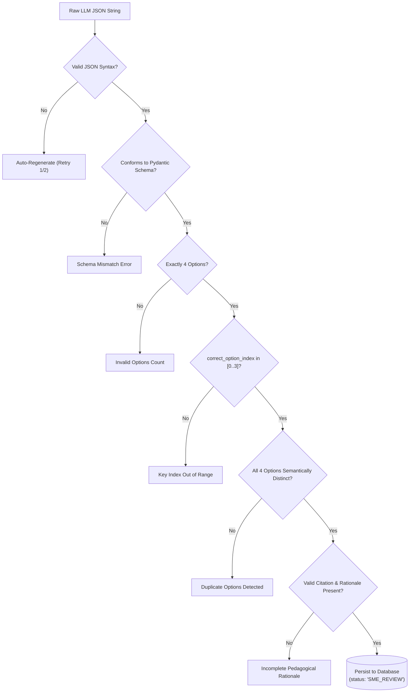
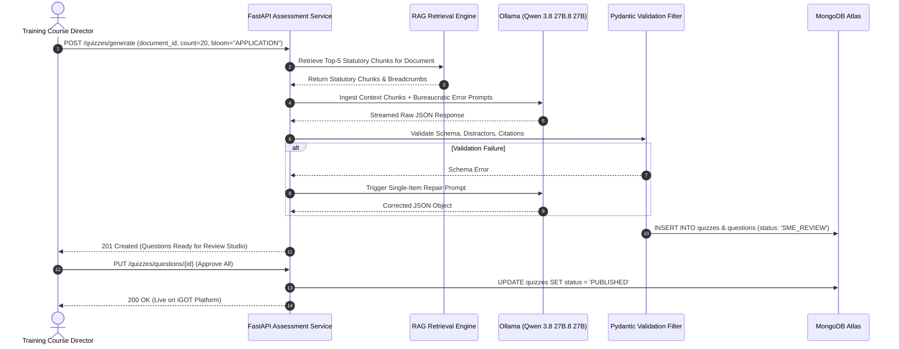

# 05_MCQ_Generation_Engine.md

# Psychometric Assessment & MCQ Generation Engine: AI Karmayogi

**Automated Item Generation (AIG), Bloom’s Taxonomy Stratification, Scenario-Based Dilemma Modeling, and Plausible Administrative Distractor Synthesis**

**Document Version:** 1.0.0  
**Target Program:** Smart India Hackathon 2026  
**Problem Statement ID:** SIH26101  
**Project Name:** AI Karmayogi  
**Classification:** Enterprise Government Specification — Phase 3 AI Engine  

---

## Table of Contents
1. [Engine Architecture & Psychometric Principles](#1-engine-architecture--psychometric-principles)
2. [Bloom’s Revised Taxonomy Stratification Model](#2-blooms-revised-taxonomy-stratification-model)
3. [Difficulty Classification Framework (Easy, Medium, Hard)](#3-difficulty-classification-framework-easy-medium-hard)
4. [Administrative Scenario-Based Dilemma Formulation](#4-administrative-scenario-based-dilemma-formulation)
5. [Plausible Distractor Synthesis & Misconception Modeling](#5-plausible-distractor-synthesis--misconception-modeling)
6. [Pedagogical Rationale & Remediation Generation](#6-pedagogical-rationale--remediation-generation)
7. [Automated Validation Pipeline & Schema Checks](#7-automated-validation-pipeline--schema-checks)
8. [Human-in-the-Loop (HITL) SME Curation Studio](#8-human-in-the-loop-hitl-sme-curation-studio)
9. [Production JSON Output Schemas](#9-production-json-output-schemas)
10. [Mermaid System Architecture & Workflow Diagrams](#10-mermaid-system-architecture--workflow-diagrams)

---

## 1. Engine Architecture & Psychometric Principles

In classical psychometrics, a Multiple Choice Question (MCQ) is only as rigorous as its **distractors** (incorrect alternatives). While consumer AI tools generate obvious, grammatically mismatched, or nonsensical distractors that are easily eliminated by guessing, the **AI Karmayogi Assessment Engine** enforces classical psychometric standards developed specifically for Indian public administration.

```
+----------------------------------------------------------------------------------------------------+
|                                    PSYCHOMETRIC ANATOMY OF AN ITEM                                 |
+----------------------------------------------------------------------------------------------------+
|                                                                                                    |
|    [ 1. THE STEM (Scenario Dilemma) ]                                                              |
|    Presents an authentic administrative situation faced by a civil servant on an active file.      |
|    Must test a concrete decision, not general trivia.                                              |
|                                                                                                    |
|    [ 2. THE KEY (Correct Option) ]                                                                 |
|    The unambiguous, legally compliant procedural action grounded strictly in the cited Rule/Act.   |
|                                                                                                    |
|    [ 3. DISTRACTOR A (Common Misconception) ]                                                      |
|    Emulates a widespread procedural error (e.g., misinterpreting GFR single tender thresholds).     |
|                                                                                                    |
|    [ 4. DISTRACTOR B (Regulatory Confusion) ]                                                      |
|    Confuses an older, superseded Office Memorandum with newly enacted gazette provisions.          |
|                                                                                                    |
|    [ 5. DISTRACTOR C (Procedural Infraction) ]                                                     |
|    Applies a valid rule from a different domain to an inapplicable situation.                      |
|                                                                                                    |
|    [ 6. REMEDIATION RATIONALE ]                                                                    |
|    Explains WHY the key is legally sound and WHY each distractor constitutes an administrative flaw|
|                                                                                                    |
+----------------------------------------------------------------------------------------------------+
```

---

## 2. Bloom’s Revised Taxonomy Stratification Model

The engine generates items across three primary cognitive tiers of **Bloom’s Revised Taxonomy**, matching the seniority and responsibilities of the civil service cadre:

```
+----------------------------------------------------------------------------------------------------+
|                                  BLOOM'S TAXONOMY STRATIFICATION                                   |
+----------------------------------------------------------------------------------------------------+
|                                                                                                    |
|  [ TIER 1: RECALL (Remember & Understand - Bloom Level 1-2) ]                                       |
|  * Target Cadres: Non-gazetted clerical personnel, Multi-Tasking Staff (MTS), Junior Assistants.   |
|  * Focus: Standardized threshold numbers, statutory definitions, authority designations.           |
|                                         |                                                          |
|                                         v                                                          |
|  [ TIER 2: APPLICATION (Apply - Bloom Level 3) ]                                                   |
|  * Target Cadres: Assistant Section Officers (ASOs), Section Officers (SOs), Under Secretaries.     |
|  * Focus: Applying financial rules (GFR), GeM procurement procedures, RTI disposal on real files.  |
|                                         |                                                          |
|                                         v                                                          |
|  [ TIER 3: ANALYSIS (Analyze & Evaluate - Bloom Level 4-5) ]                                       |
|  * Target Cadres: Deputy Secretaries, Directors, Joint Secretaries, District Magistrates.         |
|  * Focus: Resolving conflicting circulars, handling tender disputes, public crisis arbitration.   |
|                                                                                                    |
+----------------------------------------------------------------------------------------------------+
```

### Cognitive Tier Specifications:

| Cognitive Tier | Target Verbs in Prompt | Item Formulation Style | Cadre Applicability |
| :--- | :--- | :--- | :--- |
| **Recall (Level 1-2)** | *Identify, Define, State, Recall, List* | Direct statutory queries regarding limits, timeframes, or authorities. | Group C & Junior Staff |
| **Application (Level 3)** | *Apply, Execute, Compute, Implement, Select* | Practical office scenarios where the officer must process a specific file or sanction. | Group B & Section Officers |
| **Analysis (Level 4)** | *Analyze, Differentiate, Adjudicate, Reconcile* | Complex administrative dilemmas involving conflicting guidelines or statutory exceptions. | Group A & Senior Leadership |

---

## 3. Difficulty Classification Framework (Easy, Medium, Hard)

Item difficulty is dynamically calibrated through prompt-parameter constraints:

| Difficulty Tier | Linguistic Complexity | Distractor Subtlety | Cognitive Load | Psychometric $b_i$ Parameter |
| :--- | :--- | :--- | :--- | :---: |
| **Easy** | Direct prose; single statutory clause evaluated. | Distractors clearly deviate from statutory rules. | Direct recall or basic single-step rule application. | $b_i \in [-2.0, -0.8]$ |
| **Medium** | Realistic government memo format; includes caveats. | Distractors represent common procedural errors seen in audits. | Requires evaluating conditions (e.g., threshold + local content %). | $b_i \in [-0.7, +0.7]$ |
| **Hard** | Complex administrative dispute involving multiple provisos. | Distractors are highly plausible edge-case misapplications. | Multi-tier reasoning; resolving conflicting rules or exceptions. | $b_i \in [+0.8, +2.2]$ |

---

## 4. Administrative Scenario-Based Dilemma Formulation

To eliminate superficial memory testing, **Application** and **Analysis** items must be formulated as realistic **Administrative File Dilemmas**.

### Scenario Stem Anatomy Template:
1. **The Setting:** Designation of the officer and the administrative division.
2. **The Context:** Specific file, tender, grievance, or proposal under scrutiny.
3. **The Conflict / Dilemma:** A conflicting commercial brochure, urgent operational deadline, or budgetary constraint tempting a procedural shortcut.
4. **The Question Call:** The procedurally compliant action required under sovereign rules.

#### Authentic Scenario Example:
> *"You are an Under Secretary heading the General Administration Division in the Ministry of Electronics and Information Technology. Your division urgently requires 10 high-performance servers valued at ₹48,00,000 for a flagship mission. While drafting the procurement requisition on GeM, the technical committee discovers that only one vendor meets the exact proprietary specifications. However, another vendor offers an alternative architecture with comparable benchmarks at a 15% discount outside GeM. How should you proceed to ensure compliance with GFR 2017 and GeM SPV guidelines?"*

---

## 5. Plausible Distractor Synthesis & Misconception Modeling

The local **Qwen 3.8 27B.8 27B** model is conditioned with a dedicated **Bureaucratic Error Taxonomy** to generate plausible distractors:

```
+----------------------------------------------------------------------------------------------------+
|                                    BUREAUCRATIC ERROR TAXONOMY                                     |
+----------------------------------------------------------------------------------------------------+
|                                                                                                    |
|  [ ERROR 1: SPLITTING OF EXPENDITURE (GFR Rule 157 Violation) ]                                    |
|  * Misconception: Dividing a large purchase into multiple small orders to stay below ceilings.     |
|                                                                                                    |
|  [ ERROR 2: COMMERCIAL VS. STATUTORY PRIORITY CONFUSION ]                                          |
|  * Misconception: Believing a lower offline quote overrides mandatory GeM procurement (Rule 149). |
|                                                                                                    |
|  [ ERROR 3: RETROACTIVE SANCTION MISCONCEPTION ]                                                   |
|  * Misconception: Assuming post-facto financial concurrence cures an unauthorized procurement.     |
|                                                                                                    |
|  [ ERROR 4: DELEGATION OF FINANCIAL POWERS OVERREACH ]                                             |
|  * Misconception: An Under Secretary exercising financial sanction powers reserved for Joint Secy.|
|                                                                                                    |
+----------------------------------------------------------------------------------------------------+
```

The prompt directs the model to populate options using these exact behavioral failure modes, ensuring that officials who guess based on intuition or flawed habits are identified and remediated.

---

## 6. Pedagogical Rationale & Remediation Generation

Every generated item must include a complete **Two-Part Pedagogical Rationale**:
1. **Affirmative Rationale:** Explicit legal justification proving why the correct option is lawful, citing Chapter, Section, Rule, and Page numbers.
2. **Remediation of Distractors:** Clear explanation of why each incorrect option constitutes an administrative irregularity or audit para.

```text
============================= PEDAGOGICAL RATIONALE =============================
CORRECT ANSWER: Option B
LEGAL JUSTIFICATION:
Option B is legally sound under Rule 149(iii) of GFR 2017 and Ministry of Finance 
OM No. F.1/26/2018-PPD. When proprietary items exceed ₹5,00,000, procurement must 
be executed on GeM using Proprietary Article Certificate (PAC) bidding after 
approving the PAC from the Competent Authority.

WHY DISTRACTORS ARE INVALID:
- Option A is incorrect and constitutes a violation of GFR Rule 149, as public 
  procurement cannot bypass GeM simply because an offline vendor offers a discount.
- Option C is a serious financial irregularity under Rule 157 (splitting of demands 
  to evade sanction of higher authority), punishable under vigilance guidelines.
- Option D is procedurally premature, as single open tenders cannot be floated 
  without first testing GeM market availability.
=================================================================================
```

---

## 7. Automated Validation Pipeline & Schema Checks

Before an item reaches the SME Review Studio, it passes through an automated validation filter:



---

## 8. Human-in-the-Loop (HITL) SME Curation Studio

In compliance with government quality standards, the AI acts as an authoring assistant; the human Subject Matter Expert retains final statutory authority.

```
+----------------------------------------------------------------------------------------------------+
|                                  SME CURATION STUDIO WORKSPACE                                     |
+----------------------------------------------------------------------------------------------------+
|                                                                                                    |
|  [ SOURCE DOCUMENT PREVIEW ]             [ AI-GENERATED ASSESSMENT ITEM # 4 ]                      |
|  ---------------------------------       --------------------------------------------------------  |
|  Rule 149(iii) of GFR 2017:              STEM:                                                     |
|  "For goods above ₹5,00,000 ...          [ An Under Secretary is procuring specialized scanners ]  |
|  the procurement shall be through                                                                  |
|  PAC bidding on GeM ..."                 OPTIONS:                                                  |
|                                          (A) Direct offline purchase [DISTRACTOR - GFR 149 Breach] |
|  [ ACTIONS: ]                            (B) Execute GeM PAC Bidding [CORRECT KEY]                 |
|  [ Approve & Publish to iGOT ]           (C) Split into two ₹24k orders [DISTRACTOR - GFR 157]     |
|  [ Edit Stem / Option ]                  (D) Float newspaper tender [DISTRACTOR - Premature]       |
|  [ Regenerate Distractors Only ]                                                                   |
|  [ Discard Item ]                        PEDAGOGICAL RATIONALE: [ Editable Text Box ]              |
|                                                                                                    |
+----------------------------------------------------------------------------------------------------+
```

---

## 9. Production JSON Output Schemas

### Pydantic Schema Specification:
```python
from pydantic import BaseModel, Field
from typing import Literal, list

class SourceCitationModel(BaseModel):
    document_title: str
    om_reference: str
    chapter_or_rule: str
    page_number: int

class MCQItemModel(BaseModel):
    question_stem: str = Field(..., min_length=40, description="The scenario or question stem.")
    bloom_level: Literal["RECALL", "APPLICATION", "ANALYSIS"]
    difficulty: Literal["EASY", "MEDIUM", "HARD"]
    options: list[str] = Field(..., min_items=4, max_items=4, description="Array of 4 options.")
    correct_option_index: int = Field(..., ge=0, le=3, description="Zero-based index of correct option.")
    pedagogical_rationale: str = Field(..., min_length=50, description="Affirmative and distractor remediation.")
    source_citation: SourceCitationModel

class QuizGenerationResponse(BaseModel):
    quiz_title: str
    total_questions: int
    items: list[MCQItemModel]
```

---

## 10. Mermaid System Architecture & Workflow Diagrams

### End-to-End Item Synthesis Sequence



---
*End of MCQ Generation Engine Specification*
