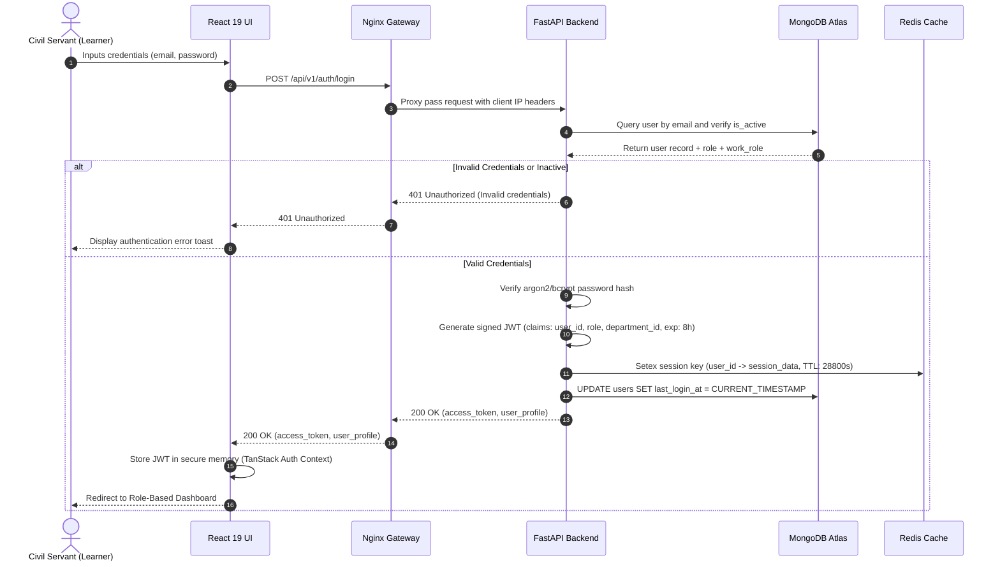
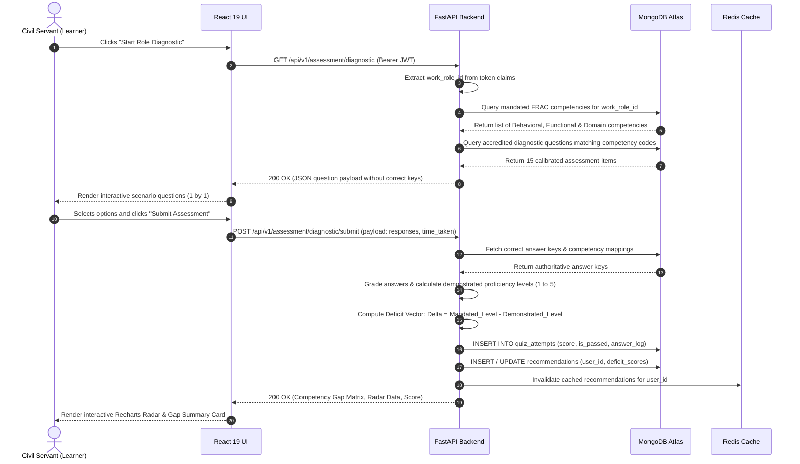
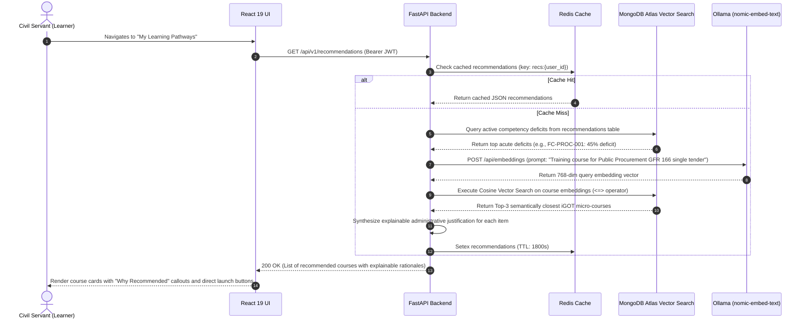
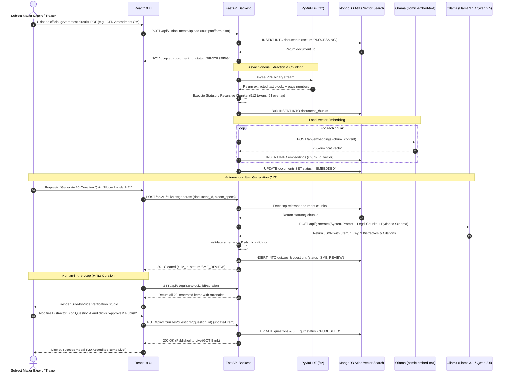

# 06_Sequence_Diagrams.md

# Sequence Architecture: AI Karmayogi

**Detailed Interaction Protocols, Asynchronous Message Flows, and Execution Lifecycles Across System Tiers**

**Document Version:** 1.0.0  
**Target Program:** Smart India Hackathon 2026  
**Problem Statement ID:** SIH26101  
**Project Name:** AI Karmayogi  
**Classification:** Enterprise Government Specification — Phase 2 Interaction Design  

---

## Table of Contents
1. [Sequence Overview & Architectural Actors](#1-sequence-overview--architectural-actors)
2. [Sequence 1: Civil Servant Authentication & SSO Session Initialization](#2-sequence-1-civil-servant-authentication--sso-session-initialization)
3. [Sequence 2: Competency Diagnostic & Adaptive Assessment Execution](#3-sequence-2-competency-diagnostic--adaptive-assessment-execution)
4. [Sequence 3: Semantic Learning Recommendation & Knowledge Graph Traversal](#4-sequence-3-semantic-learning-recommendation--knowledge-graph-traversal)
5. [Sequence 4: Document Ingestion, Autonomous AIG, and SME Review](#5-sequence-4-document-ingestion-autonomous-aig-and-sme-review)

---

## 1. Sequence Overview & Architectural Actors

This document specifies the exact runtime message sequences across five primary system tiers:
1. **User / Presentation Tier:** React 19 SPA client running in the user's browser.
2. **Reverse Proxy / Edge Gateway:** Nginx edge server handling TLS, static assets, and proxying.
3. **Application Tier:** FastAPI backend server executing business logic and orchestrating tasks.
4. **Cache & Task Queue:** Redis 7 managing session states, token blacklists, and caching.
5. **Database & Vector Store:** MongoDB Atlas Vector Search extension storing relational data and 768-dim embeddings.
6. **Local Cognitive AI Tier:** PyMuPDF engine, Ollama `nomic-embed-text` embeddings, and Ollama `Llama 3.1:8b` / `Qwen 2.5:7b` LLM.

---

## 2. Sequence 1: Civil Servant Authentication & SSO Session Initialization

This diagram details the authentication sequence, credential verification, JWT issuance, and Redis session caching.

---

## 3. Sequence 2: Competency Diagnostic & Adaptive Assessment Execution

This diagram details how baseline diagnostics are retrieved, dynamically administered, submitted, scored against FRAC benchmarks, and transformed into an explainable Competency Deficit Matrix.

---

## 4. Sequence 3: Semantic Learning Recommendation & Knowledge Graph Traversal

This sequence details how the platform evaluates diagnosed deficit vectors, queries Atlas Vector Search embeddings for semantically matched iGOT courses, and delivers explainable recommendations.

---

## 5. Sequence 4: Document Ingestion, Autonomous AIG, and SME Review

This sequence illustrates the end-to-end authoring lifecycle: uploading a government PDF, parsing via PyMuPDF, generating embeddings with `nomic-embed-text`, synthesizing scenario MCQs with Ollama `Llama 3.1`, and conducting Human-in-the-Loop (HITL) SME verification.

---
*End of Sequence Diagrams*
